# Local ReFi Toolkit: MVP Implementation Plan
**Minimum Viable Product for Rapid Validation & Core Value Delivery**

**Related Documents:**
- [[Local_ReFi_Toolkit_Master_Implementation_Plan|Master Implementation Plan]]
- [[Local_ReFi_Toolkit_Technical_Specifications|Technical Specifications]]
- [[Local_ReFi_Toolkit_Integration_Strategy|Integration Strategy]]

**Parent Project:** [[250701 Regen Coordination]]

---

## MVP Executive Summary

**Objective**: Launch a functional Local ReFi Toolkit within 8 weeks that validates core assumptions and delivers immediate value to the ReFi ecosystem while establishing foundation for full implementation.

**Core Value Proposition**: Provide **accessible, organized ReFi implementation guidance** that bridges the gap between protocol innovation and community adoption through practical, tested playbooks.

**Strategic Approach**: **Lean integration** with Ethereum Localism platform focusing on essential functionality that proves concept viability and user demand.

**MVP Investment**: $15,000 (8 weeks)
**Success Threshold**: 200+ active users, 10 successful playbook implementations, 5+ community contributions
**Go/No-Go Decision**: Based on 8-week validation metrics

---

## MVP Core Features & Scope

### Essential Components Only

#### **1. Basic Platform Integration**

**Platform Integration Features:**
- Simple section integration within ethereumlocalism.xyz
- Basic Quartz enhancement for ReFi content structure
- Mobile-responsive design
- Basic search functionality (text-based, no AI)

#### **2. Core Content Library**
- **10 Essential Playbooks** (accessible difficulty level):
  - ReFi DAO - Host 'Intro to ReFi' meetup
  - Silvi Protocol - Basic tree planting campaign
  - Grassroots Economics - Simple commitment pooling
  - Atlantis - Basic impact coordination setup
  - Community currency introduction
  - Local QF round organization
  - Impact measurement basics
  - Legal structure primer
  - Partnership development guide
  - Funding strategy template

- **5 Case Studies**:
  - ReFi Lisboa local node journey
  - ReFi Lagos climate education
  - Rifai Sicilia commitment pooling
  - Basic community currency implementation
  - Simple regenerative agriculture project

#### **3. Community Interaction**
- Basic contribution submission form
- Simple feedback system for playbooks
- Contact information for playbook authors
- Basic discussion thread for each playbook

#### **4. Essential Integrations**
- Basic Karma GAP integration (read-only)
- Simple Gitcoin project discovery link
- Basic social sharing functionality

### Deliberately Excluded from MVP
❌ Advanced AI features  
❌ Complex graph database  
❌ Advanced visualization  
❌ Multi-language support  
❌ Mobile app  
❌ Advanced analytics  
❌ Sophisticated user accounts  
❌ Complex governance systems  

---

## MVP Development Timeline

### **8-Week Implementation Overview**

### **Week 1-2: Foundation Setup**
**Partnership & Technical Foundation**

#### **Partnership Establishment** (Week 1)
- [ ] Ethereum Localism team alignment meeting
- [ ] Basic integration agreement (lightweight MOU)
- [ ] Technical requirements assessment
- [ ] Content migration plan finalization

#### **Technical Setup** (Week 2)
- [ ] Development environment setup
- [ ] Basic Quartz customization for ReFi section
- [ ] Content schema design and implementation
- [ ] Basic search functionality development

**Week 1-2 Deliverable**: Working development environment with basic ReFi section

### **Week 3-4: Content Development**
**Core Content Creation & Migration**

#### **Playbook Development** (Week 3)
- [ ] 10 essential playbooks written and formatted
- [ ] Basic templates created for future contributions
- [ ] Quality review and fact-checking
- [ ] Integration with platform structure

#### **Case Study Documentation** (Week 4)
- [ ] 5 case studies documented and verified
- [ ] Implementation success stories gathered
- [ ] Lessons learned and challenges documented
- [ ] Cross-references between playbooks and case studies

**Week 3-4 Deliverable**: Complete content library ready for launch

### **Week 5-6: Platform Integration**
**User Experience & Basic Interactions**

#### **Platform Enhancement** (Week 5)
- [ ] User-friendly navigation implementation
- [ ] Basic search and filtering functionality
- [ ] Mobile optimization
- [ ] Performance optimization

#### **Community Features** (Week 6)
- [ ] Content contribution system
- [ ] Basic feedback and rating system
- [ ] Author contact information system
- [ ] Simple discussion functionality

**Week 5-6 Deliverable**: Fully functional MVP platform

### **Week 7-8: Testing & Launch**
**Validation & Community Engagement**

#### **Beta Testing** (Week 7)
- [ ] Beta testing with 20 selected community members
- [ ] Bug fixes and user experience improvements
- [ ] Content validation and quality assurance
- [ ] Performance testing and optimization

#### **Public Launch** (Week 8)
- [ ] Public announcement across ReFi and Ethereum Localism communities
- [ ] Initial user onboarding and support
- [ ] Feedback collection and documentation
- [ ] Success metrics tracking initiation

**Week 7-8 Deliverable**: Launched MVP with initial user base

---

## MVP Resource Requirements

### **Budget Breakdown: $15,000 (8 weeks)**

#### **Development** ($9,000)
- **Platform Integration**: $4,000 (Quartz customization, basic features)
- **Frontend Development**: $3,000 (User interface, mobile optimization)
- **Backend Setup**: $2,000 (Content management, basic search)

#### **Content Development** ($4,000)
- **Playbook Creation**: $2,500 (10 playbooks + templates)
- **Case Study Documentation**: $1,000 (5 detailed case studies)
- **Quality Assurance**: $500 (Review and fact-checking)

#### **Community & Launch** ($2,000)
- **Beta Testing Coordination**: $800 (Community engagement, feedback collection)
- **Launch Marketing**: $700 (Announcements, outreach)
- **Documentation**: $500 (User guides, contribution guidelines)

### **Team Requirements**
- **Technical Lead** (0.5 FTE, 8 weeks): Platform integration and development
- **Content Coordinator** (0.5 FTE, 8 weeks): Playbook creation and quality assurance
- **Community Manager** (0.25 FTE, 8 weeks): Beta testing and launch coordination

### **Partnership Value**
**Ethereum Localism Contribution** (~$5,000 value):
- Platform hosting and infrastructure
- Existing domain authority and traffic
- Community network access
- Technical support and guidance

---

## MVP Success Metrics & Validation

### **Quantitative Success Thresholds** (8-week measurement)

#### **User Engagement**
- **200+ unique visitors** to ReFi Toolkit section
- **50+ returning users** within 8 weeks
- **Average 3+ pages per session**
- **10+ minutes average session duration**

#### **Content Utilization**
- **10+ documented playbook implementations** (any stage)
- **3+ successful complete implementations** with documented outcomes
- **50+ playbook downloads/bookmarks**
- **Average 4.0+ rating** for playbooks (5-point scale)

#### **Community Contribution**
- **5+ community-submitted contributions** (feedback, improvements, new content)
- **3+ expert reviews** or endorsements
- **10+ active community discussions** or feedback threads
- **2+ partnerships** established with local nodes or organizations

### **Qualitative Validation Indicators**

#### **User Feedback**
- **Positive sentiment** in 80%+ of user feedback
- **Clear value articulation** by users ("this helped me...")
- **Implementation success stories** with specific outcomes
- **Requests for additional content** or features

#### **Ecosystem Recognition**
- **Mentions** in ReFi community discussions or media
- **Integration requests** from other organizations
- **Expert endorsements** from protocol teams or thought leaders
- **Partnership inquiries** from potential collaborators

### **Go/No-Go Decision Framework** (Week 8 Evaluation)

```mermaid
flowchart TD
    A[Week 8 MVP Evaluation] --> B{User Engagement ≥70%?}
    A --> C{Implementation Success ≥3?}
    A --> D{Community Response Positive?}
    A --> E{Partnership Working?}
    A --> F{Sustainable Interest?}
    
    B --> B1[Yes: ✅]
    B --> B2[No: ❌]
    C --> C1[Yes: ✅]
    C --> C2[No: ❌]
    D --> D1[Yes: ✅]
    D --> D2[No: ❌]
    E --> E1[Yes: ✅]
    E --> E2[No: ❌]
    F --> F1[Yes: ✅]
    F --> F2[No: ❌]
    
    B1 & C1 & D1 & E1 & F1 --> G[🚀 GO: Proceed to Full Implementation]
    B2 & C2 & D2 --> H[❌ NO-GO: Halt or Major Pivot]
    
    B1 & C2 --> I{Some Success?}
    B2 & C1 --> I
    D2 & E1 --> I
    
    I --> I1[Yes: 🔄 PIVOT: Adjust Approach]
    I --> I2[No: ❌ NO-GO]
    
    style G fill:#90EE90
    style H fill:#FFB6C1
    style I1 fill:#FFE4B5
```

#### **GO Criteria** (Proceed to Full Implementation)
✅ **User Engagement**: Meet 70%+ of quantitative thresholds  
✅ **Implementation Success**: 3+ documented successful implementations  
✅ **Community Response**: Positive feedback and active engagement  
✅ **Partnership Validation**: Ethereum Localism partnership working effectively  
✅ **Sustainable Interest**: Clear demand for expansion and additional features  

#### **NO-GO Criteria** (Pivot or Halt)
❌ **Low Engagement**: <50% of user engagement thresholds  
❌ **Implementation Failure**: <2 successful implementations  
❌ **Negative Feedback**: Significant user complaints or criticism  
❌ **Technical Issues**: Major platform problems or integration failures  
❌ **No Community Uptake**: Lack of organic community engagement  

#### **PIVOT Criteria** (Adjust Approach)
🔄 **Moderate Success**: Some metrics met but not all  
🔄 **Different Need Identified**: Users want different functionality  
🔄 **Platform Issues**: Technical approach needs adjustment  
🔄 **Content Gaps**: Different content needed than anticipated  

---

## MVP Risk Management

### **High-Priority Risks & Mitigations**

#### **Technical Integration Risk**
- **Risk**: Difficulties integrating with Ethereum Localism platform
- **Probability**: Medium | **Impact**: High
- **Mitigation**: Early technical assessment and close collaboration with EL team
- **Contingency**: Standalone landing page as temporary solution

#### **Content Quality Risk**
- **Risk**: Playbooks not practical or accurate enough for real implementation
- **Probability**: Medium | **Impact**: High
- **Mitigation**: Expert review and community validation before launch
- **Contingency**: Rapid iteration based on user feedback

#### **User Adoption Risk**
- **Risk**: Insufficient user engagement to validate concept
- **Probability**: Medium | **Impact**: High
- **Mitigation**: Active community outreach and clear value proposition
- **Contingency**: Extended testing period with targeted user groups

#### **Partnership Risk**
- **Risk**: Ethereum Localism partnership not working as expected
- **Probability**: Low | **Impact**: Medium
- **Mitigation**: Clear communication and aligned expectations
- **Contingency**: Independent hosting while maintaining content collaboration

### **Rapid Response Protocols**

#### **Weekly Check-ins**
- Technical progress and blockers assessment
- User feedback review and issue identification
- Partnership status and communication updates
- Resource allocation and timeline adjustments

#### **Pivot Triggers**
- **Week 4**: If content development significantly behind or receiving negative feedback
- **Week 6**: If technical integration facing major issues
- **Week 8**: If user engagement below 30% of target metrics

---

## Post-MVP Roadmap

### **Success Scenario: Immediate Next Steps** (Weeks 9-12)

#### **Phase 1 Expansion**
- Add 10 additional playbooks based on user requests
- Implement basic AI-powered search functionality
- Add user accounts and contribution tracking
- Establish formal governance structure

#### **Resource Requirements**: Additional $10,000
- Expand to Phase 1 of full implementation plan
- Onboard 2-3 pilot communities for deeper testing
- Begin development of advanced features

### **Pivot Scenarios**

#### **Content-Focused Pivot**
- Focus on becoming premium content library without platform integration
- Develop subscription or community-funded model
- Partner with existing platforms for distribution

#### **Community-Focused Pivot**
- Emphasize community coordination and networking over content
- Build tools for community connection and collaboration
- Integrate with existing community platforms

#### **Technical Pivot**
- Rebuild on different technical platform
- Focus on specific technical solutions (e.g., just search, just AI)
- Partner with existing technical platforms for implementation

---

## MVP Launch Strategy

### **Pre-Launch Preparation** (Week 6-7)

#### **Community Preparation**
- [ ] Beta tester recruitment (20 diverse community members)
- [ ] Stakeholder notification and preview access
- [ ] Content review and final quality assurance
- [ ] Documentation and user guide preparation

#### **Partnership Coordination**
- [ ] Ethereum Localism community notification
- [ ] Cross-platform promotion planning
- [ ] Shared announcement content preparation
- [ ] Social media and communication strategy

### **Launch Week Activities** (Week 8)

#### **Day 1-2: Soft Launch**
- Beta tester access and immediate feedback collection
- Technical monitoring and bug fix deployment
- Community moderator training and support setup

#### **Day 3-4: Community Launch**
- ReFi ecosystem announcement across Discord, Telegram, Twitter
- Ethereum Localism community introduction
- Expert and thought leader outreach for endorsements

#### **Day 5-7: Broad Outreach**
- Social media campaign and content sharing
- Partnership announcements and cross-promotion
- Media outreach and ecosystem publication submissions

### **Post-Launch Support** (Week 8+)

#### **User Support**
- Daily monitoring of user feedback and issues
- Weekly community check-ins and support sessions
- Rapid response to technical issues or content problems

#### **Content Iteration**
- Real-time updates based on user feedback
- Additional examples and clarifications as needed
- Community contribution integration and quality assurance

---

## Success Case Study Template

**If MVP succeeds, document this progression:**

### **Week 1-2**: Foundation
- Partnership established smoothly
- Technical integration proceeding on schedule
- Team collaboration working effectively

### **Week 3-4**: Content Creation
- High-quality playbooks developed and reviewed
- Community experts providing positive feedback
- Case studies resonating with practitioners

### **Week 5-6**: Platform Integration
- User experience testing showing positive results
- Technical functionality working as expected
- Community features enabling engagement

### **Week 7-8**: Launch & Validation
- Strong user adoption from day one
- Immediate implementation attempts by users
- Positive feedback and community excitement
- Clear requests for expansion and additional features

### **Beyond Week 8**: Expansion Path
- Sustainable user growth and engagement
- Documented implementation successes
- Partnership requests from additional organizations
- Clear roadmap for full implementation plan

---

## Conclusion

This MVP plan provides a lean, focused approach to validating the Local ReFi Toolkit concept while delivering immediate value to the ReFi ecosystem. By concentrating on essential functionality and core user needs, we can quickly test our assumptions, gather valuable feedback, and build momentum for the full implementation.

**Key MVP Principles:**
1. **Start Simple**: Focus on core value proposition without complexity
2. **Validate Early**: Test assumptions with real users and real implementations
3. **Learn Fast**: Rapid iteration based on user feedback and data
4. **Build Foundation**: Create infrastructure that supports future expansion

**Success Definition**: The MVP succeeds if it demonstrates clear user demand, enables successful implementations, and provides a validated foundation for the full Local ReFi Toolkit vision.

**Next Decision Point**: Week 8 evaluation will determine whether to proceed with full implementation, pivot the approach, or explore alternative strategies based on validated learning and community response.

---

**Document Status**: MVP Plan - Ready for Implementation  
**Timeline**: 8 weeks from approval  
**Budget**: $15,000  
**Decision Point**: Week 8 Go/No-Go evaluation  
**Contact**: Regen Coordination Council for implementation approval  
**Date**: January 2025 