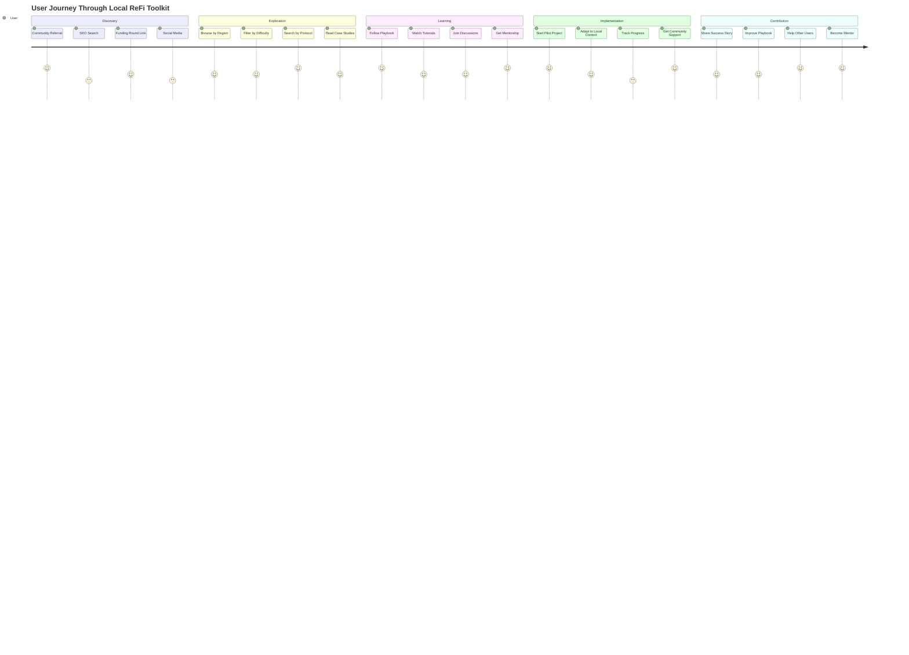
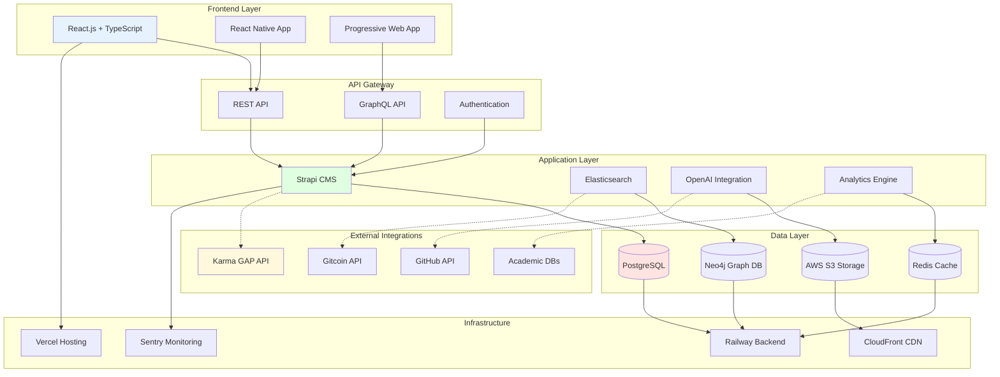
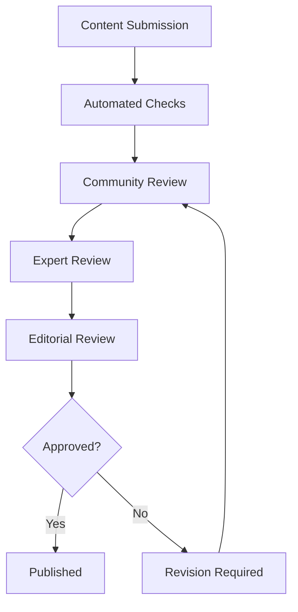

# Local ReFi Toolkit - Technical Specifications & Implementation Plan
**Version:** 1.0 Draft  
**Date:** January 2025  
**Status:** Ready for Development  

**Related Documents:**
- [[Local_ReFi_Toolkit_Master_Implementation_Plan|Master Implementation Plan]]
- [[Local_ReFi_Toolkit_Community_Coordination_Framework|Community Coordination Framework]]
- [[Local_ReFi_Toolkit_Integration_Strategy|Integration & Interoperability Strategy]]
- [[Local_ReFi_Toolkit_Resource_Mapping_Strategy|Resource Mapping & Knowledge Connection]]

**Parent Project:** [[250701 Regen Coordination]]

---

## Table of Contents
1. [Project Overview](#project-overview)
2. [Technical Architecture](#technical-architecture)
3. [Content Framework](#content-framework)
4. [User Experience Design](#user-experience-design)
5. [Implementation Roadmap](#implementation-roadmap)
6. [Technical Requirements](#technical-requirements)
7. [Integration Strategy](#integration-strategy)
8. [Quality Assurance](#quality-assurance)
9. [Success Metrics](#success-metrics)
10. [Risk Management](#risk-management)

---

## Project Overview

### Vision Statement
The Local ReFi Toolkit serves as the definitive resource for communities implementing regenerative finance (ReFi) solutions at the local level, bridging the gap between Web3 innovation and grassroots adoption through accessible, actionable, and contextually relevant guidance.

### Mission
Create a collaborative, evolving knowledge commons that documents how communities worldwide use Web3 tools to regenerate their local ecosystems and economies, providing step-by-step implementation guides, real-world case studies, and practical templates for sustainable impact.

### Strategic Context
- **Alignment**: Core infrastructure component for Ethereum Localism DDA and GG24+ funding rounds
- **Theory of Change**: Enable "cosmo-local" approach where global knowledge adapts to local contexts
- **Value Proposition**: Transform abstract Web3 concepts into tangible community impact tools

### Target Users

#### Primary Segments
1. **Web3 Novices in Regenerative Work** (40% of users)
   - Environmental activists and sustainability practitioners
   - Local community organizers and cooperative leaders
   - Traditional NGO and nonprofit staff
   - Municipal government representatives
   - **Pain Points**: Technical complexity, unclear value proposition, lack of practical guidance

2. **Web3-Aware ReFi Practitioners** (60% of users)
   - Greenpill stewards and ReFi local node leaders
   - Existing DeFi/ReFi community members
   - Web3 developers interested in social impact
   - **Pain Points**: Tool discovery, implementation best practices, measuring impact

#### User Journey Mapping



**Journey Stages:**
- **Discovery**: How users find the toolkit (SEO, community referrals, funding rounds)
- **Exploration**: Browsing available resources by region/tool/difficulty
- **Implementation**: Following step-by-step playbooks with local adaptation
- **Community**: Connecting with other implementers, sharing learnings
- **Contribution**: Adding case studies, improving playbooks, localizing content

---

## Technical Architecture

### System Architecture Overview



### Platform Strategy

#### Phase 1: MVP Platform (Months 1-3)
- **Technology Stack**: React.js frontend, Strapi CMS backend, PostgreSQL database
- **Hosting**: Vercel (frontend), Railway (backend), AWS S3 (media storage)
- **Key Features**: Content browsing, basic filtering, responsive design

#### Phase 2: Enhanced Platform (Months 4-6)
- **Additional Features**: Advanced filtering, user accounts, contribution system
- **Integrations**: Karma GAP API, GitHub for version control, Notion for content management
- **AI Integration**: OpenAI API for content recommendations and search

#### Phase 3: Advanced Platform (Months 7-12)
- **Knowledge Graph**: Neo4j graph database for content relationships
- **Visual Navigation**: Kumu maps integration for visual exploration
- **Personalization**: AI-powered learning paths and content curation
- **Mobile App**: React Native companion application

### Information Architecture

```
Local ReFi Toolkit/
├── Playbooks/
│   ├── Protocol-Specific/
│   │   ├── Silvi-Protocol/
│   │   ├── Atlantis/
│   │   ├── Grassroots-Economics/
│   │   └── Regen-Network/
│   ├── Cross-Cutting/
│   │   ├── Impact-Measurement/
│   │   ├── Community-Building/
│   │   └── Funding-Strategies/
│   └── Templates/
│       ├── Business-Models/
│       ├── Legal-Structures/
│       └── Workshop-Guides/
├── Case-Studies/
│   ├── By-Region/
│   ├── By-Tool/
│   └── By-Impact-Type/
├── Resources/
│   ├── Infographics/
│   ├── Video-Tutorials/
│   └── Templates/
└── Community/
    ├── Discussion-Forums/
    ├── Events-Calendar/
    └── Contributor-Profiles/
```

### Data Models

#### Playbook Schema
```json
{
  "id": "uuid",
  "title": "string",
  "description": "text",
  "difficulty_level": "enum[accessible, intermediate, advanced]",
  "protocol": "string",
  "chains": ["array of strings"],
  "regions": ["array of strings"],
  "impact_categories": ["ecological", "social", "economic"],
  "estimated_time": "string",
  "cost_estimate": "object",
  "prerequisites": ["array of strings"],
  "learning_outcomes": ["array of strings"],
  "content_sections": ["array of objects"],
  "resources": ["array of links"],
  "case_studies": ["array of references"],
  "authors": ["array of contributor IDs"],
  "version": "semantic version",
  "last_updated": "datetime",
  "review_status": "enum[draft, reviewed, published]",
  "tags": ["array of strings"]
}
```

#### Case Study Schema
```json
{
  "id": "uuid",
  "title": "string",
  "organization": "string",
  "location": "object[country, region, coordinates]",
  "playbooks_used": ["array of playbook IDs"],
  "implementation_period": "object[start_date, end_date]",
  "budget": "object[total, breakdown]",
  "team_size": "number",
  "impact_metrics": "object",
  "challenges": ["array of strings"],
  "lessons_learned": ["array of strings"],
  "recommendations": ["array of strings"],
  "media": ["array of file URLs"],
  "contact_info": "object",
  "public": "boolean",
  "verification_status": "enum[pending, verified, disputed]"
}
```

### API Design

#### RESTful Endpoints
- `GET /api/playbooks` - List playbooks with filtering
- `GET /api/playbooks/:id` - Get specific playbook
- `POST /api/playbooks` - Create new playbook (authenticated)
- `PUT /api/playbooks/:id` - Update playbook (authenticated)
- `GET /api/case-studies` - List case studies with filtering
- `POST /api/contributions` - Submit new content (authenticated)
- `GET /api/search` - Full-text search across all content
- `GET /api/recommendations` - AI-powered content recommendations

#### GraphQL Schema (Phase 2+)
```graphql
type Playbook {
  id: ID!
  title: String!
  description: String!
  difficultyLevel: DifficultyLevel!
  protocol: Protocol
  chains: [Blockchain!]!
  regions: [Region!]!
  caseStudies: [CaseStudy!]!
  relatedPlaybooks: [Playbook!]!
}

type CaseStudy {
  id: ID!
  title: String!
  organization: Organization!
  location: Location!
  playbooks: [Playbook!]!
  impactMetrics: ImpactMetrics!
}
```

---

## Content Framework

### Playbook Structure

#### Standard Template
1. **Overview**
   - What is this tool/protocol?
   - Who is it for?
   - Expected outcomes
   - Time and resource requirements

2. **Prerequisites**
   - Technical knowledge needed
   - Legal/regulatory considerations
   - Community readiness assessment
   - Required partnerships

3. **Step-by-Step Implementation**
   - Phase 1: Preparation and setup
   - Phase 2: Community engagement and onboarding
   - Phase 3: Deployment and testing
   - Phase 4: Launch and adoption
   - Phase 5: Monitoring and iteration

4. **Business Model Considerations**
   - Revenue generation opportunities
   - Sustainability mechanisms
   - Cost-benefit analysis
   - Risk assessment

5. **Legal and Compliance**
   - Regulatory requirements by region
   - Legal structure recommendations
   - Compliance checklists
   - Legal template library

6. **Impact Measurement**
   - Key metrics and indicators
   - Data collection methods
   - Reporting frameworks
   - Integration with Karma GAP

7. **Community Engagement**
   - Stakeholder mapping
   - Communication strategies
   - Education and onboarding
   - Building local support

8. **Troubleshooting**
   - Common challenges and solutions
   - Technical support resources
   - Community support channels
   - Expert consultation network

### Content Difficulty Levels

#### 🐣 Accessible (Beginner-Friendly)
- **Target**: Complete Web3 novices
- **Approach**: Minimal technical jargon, extensive context, visual aids
- **Examples**: Hosting ReFi meetups, basic tree planting campaigns
- **Success Criteria**: Can be implemented by non-technical community organizer

#### 🥸 Intermediate (Some Web3 Knowledge)
- **Target**: Users with basic blockchain understanding
- **Approach**: Balanced technical and practical guidance
- **Examples**: Setting up commitment pools, launching local QF rounds
- **Success Criteria**: Requires some technical support but manageable for motivated teams

#### 🪖 Advanced (Web3 Native)
- **Target**: Experienced DeFi/ReFi practitioners
- **Approach**: Technical depth, advanced configurations, integration focus
- **Examples**: Custom smart contract deployment, complex DeFi integrations
- **Success Criteria**: Requires technical expertise and development resources

### Visual Content Standards

#### Infographic Templates
- **Standard Dimensions**: 1080x1080px (Instagram), 1200x630px (Facebook/Twitter)
- **Brand Colors**: #00B894 (primary green), #FD79A8 (accent pink), #6C5CE7 (accent purple)
- **Typography**: Inter (headings), Source Sans Pro (body)
- **Template Categories**: Protocol overviews, step-by-step processes, impact metrics

#### Video Content
- **Tutorial Format**: 5-15 minute explanatory videos
- **Case Study Format**: 3-7 minute community spotlight videos
- **Production Standards**: 1080p minimum, captions required, multilingual subtitles

---

## User Experience Design

### Navigation Strategy

#### Primary Navigation
1. **Explore Playbooks**
   - Filter by: Difficulty, Protocol, Region, Impact Type, Chain
   - Sort by: Popularity, Newest, Implementation Time, Cost
   - Search: Full-text search with autocomplete

2. **Browse Case Studies**
   - Map view showing global implementations
   - Filter by: Region, Success Metrics, Organization Type
   - Success story highlights and featured implementations

3. **Community Hub**
   - Discussion forums organized by topic and region
   - Event calendar and workshop announcements
   - Contributor profiles and expert directory

4. **Resource Library**
   - Legal templates and documents
   - Technical resources and tools
   - Educational materials and presentations

#### Filtering System
```javascript
// Advanced Filtering Options
const filterOptions = {
  difficulty: ['accessible', 'intermediate', 'advanced'],
  chains: ['ethereum', 'celo', 'arbitrum', 'polygon', 'solana'],
  regions: ['north-america', 'europe', 'africa', 'asia', 'latin-america'],
  protocols: ['silvi', 'atlantis', 'grassroots-economics', 'regen-network'],
  impact_types: ['ecological', 'social', 'economic'],
  implementation_time: ['1-week', '1-month', '3-months', '6-months+'],
  budget_range: ['0-1k', '1k-5k', '5k-20k', '20k+'],
  organization_size: ['individual', 'small-team', 'organization', 'municipality']
};
```

### Responsive Design

#### Breakpoints
- **Mobile**: 320px - 767px
- **Tablet**: 768px - 1023px
- **Desktop**: 1024px+
- **Large Desktop**: 1440px+

#### Mobile-First Approach
- Progressive enhancement from mobile base
- Touch-friendly interface with 44px minimum touch targets
- Optimized loading for low-bandwidth environments
- Offline reading capability for downloaded playbooks

### Accessibility Standards

#### WCAG 2.1 AA Compliance
- **Color Contrast**: 4.5:1 ratio for normal text, 3:1 for large text
- **Keyboard Navigation**: Full site navigable without mouse
- **Screen Reader**: Semantic HTML with proper ARIA labels
- **Alternative Text**: Comprehensive alt text for all images and media

#### Multi-language Support
- **Phase 1**: English, Spanish, Portuguese
- **Phase 2**: French, Arabic, Swahili, Hindi
- **Localization**: Currency, date formats, cultural adaptations

---

## Implementation Roadmap

### Phase 1: Foundation (Months 1-3)
**Goal**: Launch MVP with core functionality

#### Month 1: Setup & Content Migration
- [ ] Development environment setup
- [ ] Design system creation
- [ ] Content audit and migration from existing sources
- [ ] Basic playbook template implementation
- [ ] Initial content creation (5 priority playbooks)

#### Month 2: Core Platform Development
- [ ] Frontend development (React.js)
- [ ] Backend API development (Strapi)
- [ ] Database schema implementation
- [ ] Basic filtering and search functionality
- [ ] Responsive design implementation

#### Month 3: Content & Testing
- [ ] Content creation sprint (10 additional playbooks)
- [ ] User testing with beta community
- [ ] Bug fixes and performance optimization
- [ ] Launch preparation and documentation

**Deliverables:**
- Functional MVP platform
- 15 complete playbooks
- 5 detailed case studies
- User testing report
- Launch strategy document

### Phase 2: Enhancement (Months 4-6)
**Goal**: Add advanced features and community functionality

#### Month 4: User Accounts & Contributions
- [ ] User authentication system
- [ ] Content contribution workflow
- [ ] Community discussion forums
- [ ] Basic analytics dashboard

#### Month 5: AI Integration & Search
- [ ] OpenAI API integration
- [ ] Intelligent content recommendations
- [ ] Enhanced search with semantic matching
- [ ] Content quality scoring system

#### Month 6: Mobile & Optimization
- [ ] Mobile app development (React Native)
- [ ] Performance optimization
- [ ] SEO implementation
- [ ] Advanced analytics setup

**Deliverables:**
- Enhanced web platform with user accounts
- Mobile application (iOS/Android)
- 30 complete playbooks
- 15 detailed case studies
- AI recommendation system

### Phase 3: Scale (Months 7-12)
**Goal**: Advanced features and global expansion

#### Months 7-9: Advanced Features
- [ ] Knowledge graph implementation
- [ ] Visual navigation (Kumu integration)
- [ ] Advanced impact tracking
- [ ] Multi-language support

#### Months 10-12: Global Expansion
- [ ] Regional adaptation guidelines
- [ ] Local partner onboarding
- [ ] Advanced collaboration tools
- [ ] Enterprise features for municipalities

**Deliverables:**
- Fully-featured platform with visual navigation
- 50+ playbooks across all difficulty levels
- 30+ case studies from diverse regions
- Multi-language support (3 languages)
- Partnership network with 10+ organizations

---

## Technical Requirements

### Development Stack

#### Frontend
- **Framework**: React.js 18+ with TypeScript
- **Styling**: Tailwind CSS with custom component library
- **State Management**: Redux Toolkit for complex state, React Context for simple state
- **Routing**: React Router v6
- **Build Tool**: Vite for fast development and building
- **Testing**: Jest + React Testing Library

#### Backend
- **CMS**: Strapi v4 (headless CMS for content management)
- **Database**: PostgreSQL 15+ for relational data
- **Graph Database**: Neo4j (Phase 3) for knowledge relationships
- **Authentication**: Strapi built-in auth + custom JWT implementation
- **File Storage**: AWS S3 with CloudFront CDN
- **Search**: Elasticsearch for full-text search

#### Infrastructure
- **Hosting**: 
  - Frontend: Vercel (automatic deployments from GitHub)
  - Backend: Railway (container-based hosting)
  - Database: Railway PostgreSQL or AWS RDS
- **Monitoring**: Sentry for error tracking, Mixpanel for analytics
- **CI/CD**: GitHub Actions for automated testing and deployment

#### Third-Party Integrations
- **AI Services**: OpenAI GPT-4 API for content recommendations
- **Maps**: Mapbox for case study location visualization
- **Analytics**: Google Analytics 4 + custom dashboard
- **Communication**: Discord/Telegram bot integration for community
- **Version Control**: GitHub for code, content versioning

### Performance Requirements

#### Page Load Times
- **Mobile**: < 3 seconds for initial page load
- **Desktop**: < 2 seconds for initial page load
- **Content Pages**: < 1 second for subsequent navigation
- **Search Results**: < 500ms response time

#### Scalability Targets
- **Concurrent Users**: 1,000+ simultaneous users
- **Content Volume**: 100+ playbooks, 500+ case studies
- **Geographic Distribution**: Global CDN with edge caching
- **Database Performance**: < 100ms for complex queries

#### Accessibility Requirements
- **WCAG 2.1 AA**: Full compliance for accessibility standards
- **Screen Reader**: Comprehensive support for assistive technologies
- **Keyboard Navigation**: Full functionality without mouse
- **Performance**: Accessible on low-end devices and slow connections

---

## Integration Strategy

### Partner Platform Integrations

#### Karma GAP Integration
```javascript
// Impact data synchronization
const karmaGapAPI = {
  endpoint: 'https://api.karmahq.xyz',
  authentication: 'Bearer token',
  endpoints: {
    projects: '/projects',
    updates: '/updates',
    metrics: '/metrics'
  }
};

// Sync case study impact data
async function syncImpactData(caseStudyId) {
  const karmaData = await karmaGapAPI.getProjectData(caseStudyId);
  return {
    outputs: karmaData.outputs,
    outcomes: karmaData.outcomes,
    impact_metrics: karmaData.impact_metrics,
    last_updated: karmaData.updated_at
  };
}
```

#### Open Civics Knowledge Garden
- **Content Syndication**: Two-way content sharing with attribution
- **Standard Adoption**: Use compatible metadata schemas
- **Cross-Linking**: Bidirectional references between platforms
- **API Integration**: Real-time content updates and notifications

#### Ethereum Localism Ecosystem
- **Event Integration**: Sync with DevConnect, local meetups, workshops
- **Project Database**: Cross-reference with Ethereum localism projects
- **Funding Rounds**: Integration with Gitcoin rounds and proposal systems
- **Community**: Shared contributor profiles and reputation systems

### GitHub Integration
```yaml
# GitHub Actions workflow for content updates
name: Content Sync
on:
  push:
    paths: ['content/**']
workflow:
  - validate_content_schema
  - generate_metadata
  - update_search_index
  - deploy_to_staging
  - run_content_quality_checks
  - deploy_to_production
```

### API Ecosystem
- **RESTful API**: Public API for third-party integrations
- **GraphQL**: Advanced querying for complex applications
- **Webhooks**: Real-time notifications for content updates
- **SDK**: JavaScript/Python SDKs for easy integration

---

## Quality Assurance

### Content Quality Framework

#### Editorial Standards
1. **Accuracy Review**
   - Technical accuracy verification by protocol experts
   - Community feedback integration
   - Regular content audits and updates
   - Version control with change tracking

2. **Accessibility Standards**
   - Plain language guidelines (8th grade reading level)
   - Visual accessibility (alt text, color contrast)
   - Cultural sensitivity review
   - Multi-language localization quality

3. **Community Validation**
   - Peer review process for new playbooks
   - Implementation testing by community members
   - Success story verification
   - Expert advisory panel oversight

#### Review Process


### Testing Strategy

#### User Acceptance Testing
- **Beta Testing Group**: 50 diverse community members
- **Testing Scenarios**: Real-world implementation attempts
- **Feedback Collection**: Structured interviews and surveys
- **Iteration Cycles**: 2-week feedback and improvement cycles

#### Technical Testing
- **Unit Testing**: 90%+ code coverage requirement
- **Integration Testing**: API and database interaction testing
- **End-to-End Testing**: Complete user journey automation
- **Performance Testing**: Load testing for scalability validation
- **Security Testing**: Regular penetration testing and vulnerability assessments

#### Content Testing
- **Implementation Testing**: Community members test playbooks
- **Accessibility Testing**: Screen reader and keyboard navigation testing
- **Localization Testing**: Cultural and linguistic appropriateness
- **Impact Verification**: Success story validation and metrics verification

---

## Success Metrics

### Quantitative KPIs

#### User Engagement
- **Monthly Active Users**: Target 10,000 by Month 12
- **Session Duration**: Average 8+ minutes per session
- **Page Views per Session**: 4+ pages per visit
- **Return User Rate**: 60%+ monthly return rate
- **Content Completion**: 70%+ playbook completion rate

#### Content Quality
- **Playbook Success Rate**: 80%+ successful implementations
- **Community Contributions**: 50+ community-created playbooks
- **Translation Coverage**: 90%+ content available in 3 languages
- **Update Frequency**: Monthly content updates and reviews

#### Impact Metrics
- **Implementations Tracked**: 500+ documented implementations
- **Capital Mobilized**: $1M+ in local ReFi projects enabled
- **Geographic Reach**: Active users in 50+ countries
- **Protocol Adoption**: 20+ protocols documented

### Qualitative Indicators

#### Community Health
- **User Satisfaction**: 4.5+ stars average rating
- **Community Growth**: Active contributor community (100+ regular contributors)
- **Expert Endorsement**: Recognition from key ReFi leaders
- **Media Coverage**: Coverage in Web3 and sustainability media

#### Strategic Impact
- **Partner Integration**: 10+ integrated partner platforms
- **Funding Round Integration**: Used in 5+ Gitcoin rounds
- **Municipal Adoption**: 3+ municipal government implementations
- **Academic Recognition**: Citation in research papers and case studies

### Analytics Implementation

#### Tracking Strategy
```javascript
// Analytics event tracking
const trackingEvents = {
  playbook_view: ['playbook_id', 'user_type', 'source'],
  playbook_completion: ['playbook_id', 'completion_time', 'success_rating'],
  case_study_submission: ['organization_type', 'region', 'impact_metrics'],
  community_contribution: ['content_type', 'quality_score', 'peer_rating'],
  search_query: ['query_text', 'results_count', 'click_through_rate']
};
```

#### Dashboard Requirements
- **Real-time Metrics**: Live user activity and content performance
- **Geographic Distribution**: Global usage patterns and regional adoption
- **Content Performance**: Playbook success rates and user feedback scores
- **Community Health**: Contribution rates and community engagement levels

---

## Risk Management

### Technical Risks

#### Risk: Platform Downtime
- **Probability**: Medium
- **Impact**: High
- **Mitigation**: 
  - Multi-region deployment with automatic failover
  - Database replication and backup systems
  - CDN for static content delivery
  - 99.9% uptime SLA with hosting providers

#### Risk: Data Loss
- **Probability**: Low
- **Impact**: Very High
- **Mitigation**:
  - Daily automated backups to multiple locations
  - Version control for all content changes
  - Disaster recovery procedures documented and tested
  - Content mirroring with partner organizations

#### Risk: Security Breach
- **Probability**: Medium
- **Impact**: High
- **Mitigation**:
  - Regular security audits and penetration testing
  - Data encryption at rest and in transit
  - Multi-factor authentication for admin accounts
  - Security monitoring and incident response procedures

### Content Risks

#### Risk: Inaccurate Technical Information
- **Probability**: Medium
- **Impact**: High
- **Mitigation**:
  - Expert review process for all technical content
  - Community feedback and correction mechanisms
  - Version control with change attribution
  - Clear disclaimer and liability limitations

#### Risk: Outdated Information
- **Probability**: High
- **Impact**: Medium
- **Mitigation**:
  - Quarterly content review cycles
  - Automated notifications for protocol updates
  - Community-driven update requests
  - Clear versioning and publication dates

### Strategic Risks

#### Risk: Partner Conflicts
- **Probability**: Medium
- **Impact**: Medium
- **Mitigation**:
  - Clear partnership agreements and boundaries
  - Neutral governance structure
  - Conflict resolution procedures
  - Alternative partnership options

#### Risk: Funding Sustainability
- **Probability**: Medium
- **Impact**: High
- **Mitigation**:
  - Diversified funding sources (grants, partnerships, premium features)
  - Revenue model development for sustainability
  - Strong value proposition for continued support
  - Community ownership and governance transition

### Contingency Planning

#### Platform Migration Strategy
- **Cloud Provider Backup**: Alternative hosting arrangements ready
- **Data Export**: Complete data export capabilities maintained
- **Partner Hosting**: Agreements for emergency hosting with partners
- **Offline Access**: Downloadable versions of critical content

#### Community Continuity
- **Governance Transition**: Community ownership structure prepared
- **Content Licensing**: Open source licensing for community control
- **Contributor Network**: Distributed maintenance capabilities
- **Partner Relationships**: Multiple organizations capable of hosting

---

## Conclusion

The Local ReFi Toolkit represents a critical infrastructure investment for the regenerative finance ecosystem, providing the bridge between innovative Web3 technologies and practical local implementation. This specification provides a comprehensive roadmap for building a platform that serves both technical and non-technical users while maintaining high standards for content quality, user experience, and community engagement.

Success will be measured not just in user metrics, but in the real-world impact enabled by the toolkit: the number of local communities successfully implementing ReFi solutions, the capital mobilized for regenerative projects, and the expansion of the ReFi ecosystem through practical, accessible resources.

The phased development approach allows for learning and iteration while building toward a robust, scalable platform that can grow with the ecosystem. By maintaining strong partnerships with key organizations and ensuring community ownership, the toolkit will serve as a lasting resource for the regenerative finance movement.

---

**Next Steps:**
1. **Technical Review**: Engineering team review of technical specifications
2. **Budget Planning**: Detailed cost estimation for each development phase
3. **Partnership Agreements**: Formal agreements with key integration partners
4. **Content Strategy**: Detailed content creation plan and editorial calendar
5. **Community Engagement**: Beta tester recruitment and feedback systems
6. **Launch Planning**: Marketing strategy and community outreach plan

**Document Control:**
- **Version**: 1.0 Draft
- **Last Updated**: January 2025
- **Next Review**: February 2025
- **Approved By**: [To be completed]
- **Distribution**: Regen Coordination Council, Development Team, Key Partners 