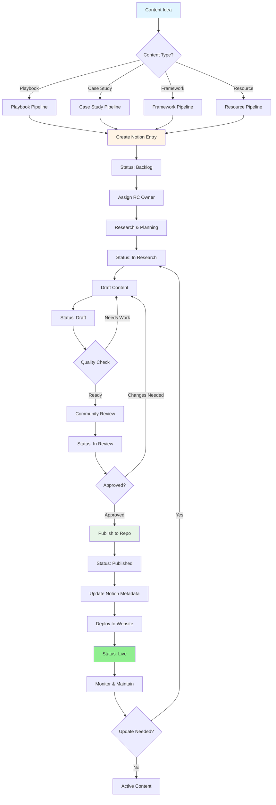

# Local ReFi Toolkit: Content Development Pipeline

**Version:** 1.0  
**Last Updated:** October 2025  
**Status:** Active  
**Maintained By:** Regen Coordination Council

---

## 📋 Table of Contents

1. [Pipeline Overview](#pipeline-overview)
2. [Content Lifecycle Stages](#content-lifecycle-stages)
3. [Roles & Responsibilities](#roles--responsibilities)
4. [Content Types & Workflows](#content-types--workflows)
5. [Quality Assurance Process](#quality-assurance-process)
6. [Repository-Notion Sync](#repository-notion-sync)
7. [Automation & Tools](#automation--tools)

---

## 🎯 Pipeline Overview

### Purpose
This pipeline ensures systematic, high-quality content creation that aligns repository development with project management tracking in Notion.

### Core Principles
- **Template-Driven**: All content follows standardized templates
- **Community-Validated**: Content reviewed by practitioners and experts
- **Synced Tracking**: Repository and Notion database stay aligned
- **Iterative Quality**: Continuous improvement through feedback loops

### Pipeline Flow



---

## 🔄 Content Lifecycle Stages

### Stage 1: Ideation (Backlog)
**Notion Status:** `Backlog`  
**Git Status:** Not yet in repository

**Activities:**
- [ ] Create Notion database entry
- [ ] Define content scope and objectives
- [ ] Identify target audience
- [ ] List prerequisites and dependencies
- [ ] Assign RC Owner
- [ ] Set difficulty level (if applicable)
- [ ] Tag with relevant metadata (chains, regions, protocols)

**Deliverables:**
- Notion entry with complete metadata
- Initial content outline or proposal

**Duration:** 1-3 days

---

### Stage 2: Research & Planning (In Research)
**Notion Status:** `In Research`  
**Git Status:** Not yet in repository

**Activities:**
- [ ] Research existing implementations and resources
- [ ] Interview subject matter experts
- [ ] Gather data, metrics, and evidence
- [ ] Review related content (playbooks, case studies)
- [ ] Create detailed content outline
- [ ] Identify required assets (diagrams, images)

**Deliverables:**
- Comprehensive content outline
- Research notes and references
- Asset requirements list

**Duration:** 3-7 days

---

### Stage 3: Content Creation (Draft)
**Notion Status:** `Draft`  
**Git Status:** Work-in-progress branch

**Activities:**
- [ ] Create new branch: `content/[type]/[name]`
- [ ] Copy appropriate template from `content/04-resources/templates/`
- [ ] Fill in all template sections
- [ ] Add diagrams, images, and visual aids
- [ ] Link to related content (case studies, playbooks)
- [ ] Write TLDR summary
- [ ] Self-review against quality checklist

**Deliverables:**
- Complete draft in repository branch
- All sections filled with substantive content
- Proper markdown formatting and links

**Duration:** 5-14 days

**Quality Checklist:**
- [ ] All template sections completed
- [ ] Clear, actionable content
- [ ] Proper markdown formatting
- [ ] Working internal and external links
- [ ] Visual aids included where helpful
- [ ] TLDR summary written
- [ ] Metadata tags accurate

---

### Stage 4: Internal Review (In Review)
**Notion Status:** `In Review`  
**Git Status:** Pull request created

**Activities:**
- [ ] Create pull request with description
- [ ] Assign reviewers (min. 2)
- [ ] RC Owner review for alignment
- [ ] Technical expert review (if applicable)
- [ ] Community representative review
- [ ] Address review feedback
- [ ] Update content based on suggestions

**Deliverables:**
- Pull request with review comments
- Updated content addressing feedback
- Approval from all reviewers

**Duration:** 3-7 days

**Review Criteria:**
- [ ] **Accuracy**: Information is correct and up-to-date
- [ ] **Clarity**: Content is easy to understand
- [ ] **Completeness**: All necessary information included
- [ ] **Actionability**: Clear steps and guidance provided
- [ ] **Alignment**: Fits toolkit vision and standards
- [ ] **Attribution**: Proper credits and sources cited

---

### Stage 5: Community Validation (Community Review)
**Notion Status:** `Community Review`  
**Git Status:** Pull request approved, awaiting community feedback

**Activities:**
- [ ] Share draft with relevant community members
- [ ] Post in Discord/Telegram for feedback
- [ ] Conduct expert interviews (if needed)
- [ ] Test implementation steps (for playbooks)
- [ ] Gather testimonials and quotes
- [ ] Final edits based on community input

**Deliverables:**
- Community feedback documentation
- Validated content with real-world input
- Testimonials or endorsements (if applicable)

**Duration:** 5-10 days

---

### Stage 6: Publication (Published)
**Notion Status:** `Published`  
**Git Status:** Merged to main branch

**Activities:**
- [ ] Final review and polish
- [ ] Merge pull request to main
- [ ] Update Notion with publication date
- [ ] Add repository file path to Notion
- [ ] Update navigation and cross-references
- [ ] Update main README if needed
- [ ] Trigger website deployment

**Deliverables:**
- Content live in repository main branch
- Notion database updated with metadata
- Navigation structure updated

**Duration:** 1-2 days

---

### Stage 7: Deployment (Live)
**Notion Status:** `Live`  
**Git Status:** Deployed to GitHub Pages

**Activities:**
- [ ] Verify deployment successful
- [ ] Test all links and formatting on live site
- [ ] Update Notion with live URL
- [ ] Announce new content (social media, Discord)
- [ ] Add to monthly newsletter
- [ ] Monitor initial user feedback

**Deliverables:**
- Content accessible on toolkit.refi.community
- Announcement post published
- Initial engagement metrics tracked

**Duration:** 1-2 days

---

### Stage 8: Maintenance (Active)
**Notion Status:** `Active` or `Needs Update`  
**Git Status:** Main branch

**Activities:**
- [ ] Monitor for broken links (quarterly)
- [ ] Review for outdated information (quarterly)
- [ ] Update based on protocol changes
- [ ] Add new case studies or examples
- [ ] Respond to community feedback
- [ ] Track usage analytics

**Deliverables:**
- Quarterly review notes
- Updates as needed
- Maintained quality and relevance

**Duration:** Ongoing

---

## 👥 Roles & Responsibilities

### RC (Regen Coordination) Owner
**Primary responsibility for content piece from ideation to publication**

**Responsibilities:**
- Lead content development process
- Ensure quality and alignment with toolkit vision
- Coordinate with subject matter experts
- Manage timeline and deliverables
- Update Notion database status
- Respond to community feedback

### Content Contributor
**Subject matter expert or community member creating content**

**Responsibilities:**
- Research and gather information
- Write initial draft using templates
- Incorporate reviewer feedback
- Maintain content quality standards
- Provide ongoing updates as needed

### Technical Reviewer
**Reviews technical accuracy and implementation details**

**Responsibilities:**
- Verify technical information accuracy
- Test implementation steps (for playbooks)
- Ensure protocol details are current
- Validate code examples and configurations
- Check external resource links

### Community Reviewer
**Represents end-user perspective and community needs**

**Responsibilities:**
- Evaluate clarity and accessibility
- Test usability of instructions
- Provide practitioner perspective
- Ensure cultural sensitivity
- Validate real-world applicability

### Repository Maintainer
**Manages git repository and technical infrastructure**

**Responsibilities:**
- Review pull requests for technical quality
- Manage repository structure and organization
- Ensure proper markdown formatting
- Maintain deployment pipeline
- Handle technical issues

---

## 📝 Content Types & Workflows

### 1. Playbooks

**Purpose:** Step-by-step implementation guides for ReFi tools and protocols

**Template:** `content/04-resources/templates/playbook-template.md`

**Workflow:**
1. **Ideation** (2-3 days)
   - Identify protocol or implementation need
   - Research existing documentation
   - Define target audience and difficulty level

2. **Research** (5-7 days)
   - Study protocol documentation
   - Interview successful implementers
   - Identify common challenges
   - Gather resource requirements

3. **Drafting** (7-14 days)
   - Use playbook template
   - Write all sections with detail
   - Create implementation diagrams
   - Add troubleshooting guidance

4. **Review** (5-7 days)
   - Technical expert review
   - Community practitioner review
   - Protocol team review (if applicable)

5. **Testing** (Optional, 7-14 days)
   - Pilot with test community
   - Document results and refinements

6. **Publication** (2-3 days)
   - Final edits and polish
   - Merge and deploy

**Metadata Required:**
- Difficulty Level: 🐣 Accessible / 🥸 Intermediate / 🪖 Advanced
- Chain Deployment: Celo, Regen Network, Arbitrum, etc.
- Lead Authors: Names of primary contributors
- Related Case Studies: Links to implementations
- Type: Playbook
- RC Owner: Assigned coordinator

**Location:** `content/01-playbooks/[category]/[name].md`

---

### 2. Case Studies

**Purpose:** Document real-world ReFi implementations with lessons learned

**Template:** `content/04-resources/templates/case-study-template.md`

**Workflow:**
1. **Identification** (1-2 days)
   - Identify successful implementation
   - Contact community leaders
   - Confirm willingness to participate

2. **Research** (5-10 days)
   - Conduct interviews with stakeholders
   - Gather metrics and impact data
   - Collect photos and visual assets
   - Review existing documentation

3. **Drafting** (5-10 days)
   - Use case study template
   - Write implementation story
   - Document challenges and solutions
   - Include quantitative metrics

4. **Validation** (5-7 days)
   - Review with featured community
   - Verify facts and figures
   - Obtain approval for publication
   - Get quotes and testimonials

5. **Publication** (2-3 days)
   - Final edits with community input
   - Add to appropriate category
   - Link to related playbooks

**Metadata Required:**
- Region/Location: Geographic context
- Protocols Used: Technical tools deployed
- Community Type: Urban, rural, indigenous, etc.
- Impact Area: Environmental, social, economic
- Status: Active, Completed, Ongoing
- Lead Authors: Case study compiler
- Type: Case Study
- RC Owner: Assigned coordinator

**Location:** `content/02-case-studies/[by-region|by-impact-type]/[name].md`

---

### 3. Frameworks

**Purpose:** Provide conceptual and organizational blueprints for ReFi implementation

**Template:** `content/04-resources/templates/framework-template.md`

**Workflow:**
1. **Conceptualization** (3-5 days)
   - Identify coordination or measurement need
   - Research existing frameworks
   - Define scope and application

2. **Development** (10-14 days)
   - Create framework structure
   - Define principles and components
   - Develop implementation guidance
   - Create visual models

3. **Expert Review** (7-10 days)
   - Academic review for rigor
   - Practitioner review for applicability
   - Multiple stakeholder feedback

4. **Pilot Testing** (Optional, 14-30 days)
   - Test with pilot communities
   - Gather feedback and refine
   - Document adaptations

5. **Publication** (3-5 days)
   - Finalize documentation
   - Create diagrams and visuals
   - Publish and announce

**Metadata Required:**
- Framework Type: Governance, Impact Measurement, Coordination
- Specialization: Specific focus area
- Complexity: Basic, Intermediate, Advanced
- Lead Authors: Framework developers
- Type: Framework
- RC Owner: Assigned coordinator

**Location:** `content/03-frameworks/[category]/[name].md`

---

### 4. Quick Start Guides

**Purpose:** Provide rapid onboarding for immediate ReFi action (2-8 hours)

**Template:** Simplified playbook template

**Workflow:**
1. **Ideation** (1-2 days)
   - Identify common entry point need
   - Define minimal viable implementation
   - Set realistic time expectations

2. **Drafting** (3-5 days)
   - Focus on essential steps only
   - Remove advanced complexity
   - Emphasize quick wins

3. **User Testing** (3-5 days)
   - Test with newcomers
   - Time actual implementation
   - Refine for clarity

4. **Publication** (1-2 days)
   - Final polish
   - Publish and promote

**Metadata Required:**
- Time Investment: 2-4 hours, 4-6 hours, 6-8 hours
- Difficulty Level: 🐣 Accessible
- Type: Playbook (Quick Start)
- RC Owner: Assigned coordinator

**Location:** `content/01-playbooks/quick-start/[name].md`

---

## ✅ Quality Assurance Process

### Content Quality Standards

#### 1. Accuracy
- [ ] All factual information verified
- [ ] Technical details reviewed by experts
- [ ] Protocol information current and accurate
- [ ] External links working and relevant
- [ ] Contact information verified

#### 2. Clarity
- [ ] Written in clear, accessible language
- [ ] Technical jargon explained or avoided
- [ ] Logical flow and structure
- [ ] Adequate context provided
- [ ] Examples and illustrations included

#### 3. Completeness
- [ ] All template sections filled
- [ ] Comprehensive coverage of topic
- [ ] Prerequisites clearly stated
- [ ] Resources and references included
- [ ] Next steps guidance provided

#### 4. Actionability
- [ ] Step-by-step instructions clear
- [ ] Implementation requirements specified
- [ ] Success criteria defined
- [ ] Troubleshooting guidance included
- [ ] Real-world examples provided

#### 5. Alignment
- [ ] Fits toolkit vision and principles
- [ ] Consistent with existing content
- [ ] Proper cross-referencing
- [ ] Supports regenerative outcomes
- [ ] Community-centered approach

#### 6. Attribution
- [ ] Original sources cited
- [ ] Contributors acknowledged
- [ ] Community consent obtained (for case studies)
- [ ] License information clear
- [ ] Version and date documented

---

### Review Checklist by Content Type

#### Playbook Review Checklist
- [ ] Clear target audience defined
- [ ] Difficulty level appropriate
- [ ] Implementation steps detailed and tested
- [ ] Resource requirements specified
- [ ] Success metrics defined
- [ ] Troubleshooting section complete
- [ ] Related case studies linked
- [ ] Technical accuracy verified
- [ ] Community validation obtained

#### Case Study Review Checklist
- [ ] Community consent obtained
- [ ] Facts and figures verified
- [ ] Impact metrics documented
- [ ] Challenges honestly addressed
- [ ] Lessons learned articulated
- [ ] Replication guidance provided
- [ ] Contact information current
- [ ] Photos and assets optimized
- [ ] Related playbooks linked

#### Framework Review Checklist
- [ ] Theoretical foundation sound
- [ ] Practical applicability demonstrated
- [ ] Implementation guidance clear
- [ ] Visual models included
- [ ] Academic rigor maintained
- [ ] Practitioner feedback incorporated
- [ ] Pilot testing completed (if applicable)
- [ ] Adaptation guidance provided
- [ ] Measurement criteria defined

---

## 🔄 Repository-Notion Sync

### Sync Protocol

**Frequency:** Weekly (Mondays) + Real-time for major updates

**Sync Points:**
1. Content transitions between stages
2. New content added to repository
3. Content published to website
4. Metadata updates or corrections
5. Content archived or deprecated

---

### Notion Database Structure

**Required Fields:**
- **Name** (title): Content title
- **Type** (multi-select): Playbook, Case Study, Framework, Tool, Template, Resource
- **Status** (status): Backlog → In Research → Draft → In Review → Community Review → Published → Live → Active / Needs Update / Archived
- **RC Owner** (person): Assigned coordinator
- **Lead Authors** (rich text): Content creators
- **Difficulty Level** (select): 🐣 Accessible, 🥸 Intermediate, 🪖 Advanced, N/A
- **Chain Deployment** (multi-select): Celo, Regen Network, Arbitrum, Solana, etc.
- **References** (relation): Links to related content
- **Published?** (checkbox): Is it live on website?
- **Last edited time** (last edited): Auto-tracked

**Additional Useful Fields:**
- **Repository Path** (text): File path in repo (e.g., `content/01-playbooks/quick-start/Community-ReFi-Assessment.md`)
- **Website URL** (URL): Live URL on toolkit.refi.community
- **Created Date** (date): When ideation started
- **Published Date** (date): When went live
- **Last Review Date** (date): Last quality review
- **Next Review Due** (date): Quarterly maintenance schedule
- **Community Contact** (text): For case studies
- **Protocols Used** (multi-select): Specific protocols featured
- **Region** (multi-select): Geographic context
- **Impact Area** (multi-select): Environmental, Social, Economic, Governance

---

### Sync Workflow

#### Weekly Manual Sync (Recommended Initially)

**Every Monday, 30 minutes:**

1. **Repository → Notion** (Update existing entries)
   ```bash
   # List all content files modified in past week
   cd /path/to/Local-ReFi-Toolkit
   git log --since="1 week ago" --name-only --pretty=format: | sort -u | grep "^content/"
   ```

   For each modified file:
   - [ ] Locate corresponding Notion entry
   - [ ] Update status if changed (e.g., merged PR → Published)
   - [ ] Add repository path if new
   - [ ] Add website URL if published
   - [ ] Update metadata (dates, authors, etc.)

2. **Notion → Repository** (Add new items to backlog)
   - [ ] Review new Notion entries in Backlog
   - [ ] Create GitHub Issues for new content ideas
   - [ ] Assign to RC Owners
   - [ ] Link Notion entry to GitHub Issue

3. **Status Reconciliation** (Ensure alignment)
   - [ ] Check Published items have repository files
   - [ ] Check Live items have website URLs
   - [ ] Flag discrepancies for review

**Time Required:** 20-30 minutes/week

---

#### Semi-Automated Sync (Phase 2)

**Setup GitHub Actions workflow:**

```yaml
# .github/workflows/notion-sync.yml
name: Sync Repository with Notion

on:
  push:
    branches: [main]
    paths:
      - 'content/**/*.md'
  schedule:
    - cron: '0 9 * * 1'  # Every Monday at 9 AM
  workflow_dispatch:

jobs:
  sync:
    runs-on: ubuntu-latest
    steps:
      - uses: actions/checkout@v3
      
      - name: Sync to Notion
        env:
          NOTION_API_KEY: ${{ secrets.NOTION_API_KEY }}
          NOTION_DATABASE_ID: ${{ secrets.NOTION_DATABASE_ID }}
        run: |
          # Script to update Notion based on repo changes
          # See: scripts/notion-sync.js
          npm install @notionhq/client
          node scripts/notion-sync.js
```

**Benefits:**
- Automatic status updates when content merged
- Reduced manual maintenance burden
- Real-time sync on major changes

**Implementation Timeline:** Month 3-4 (Post-MVP)

---

### Repository-to-Notion Status Mapping

| Repository State | Git Branch | Notion Status |
|------------------|------------|---------------|
| Not in repo | - | `Backlog` |
| Planning/Research | - | `In Research` |
| Working branch | `content/[type]/[name]` | `Draft` |
| Pull request open | PR open | `In Review` |
| Community feedback | PR approved, not merged | `Community Review` |
| Merged to main | `main` | `Published` |
| Deployed to site | GitHub Pages | `Live` |
| Live & maintained | `main`, deployed | `Active` |
| Needs updates | `main`, deployed | `Needs Update` |
| Deprecated | `main`, hidden | `Archived` |

---

## 🤖 Automation & Tools

### Current Tools

1. **GitHub Repository**
   - Version control and collaboration
   - Pull request workflow
   - GitHub Actions for deployment
   - **Location:** https://github.com/[org]/Local-ReFi-Toolkit

2. **Notion Database**
   - Project management and tracking
   - Metadata and status management
   - Team coordination
   - **Location:** https://www.notion.so/2816ed0845cb813789fae2d15c9d39e3

3. **Quartz Static Site**
   - Content publishing platform
   - GitHub Pages deployment
   - **URL:** https://toolkit.refi.community

4. **Markdown Templates**
   - Standardized content structure
   - **Location:** `content/04-resources/templates/`

---

### Proposed Automation (Phase 2)

#### 1. Notion API Integration
**Purpose:** Sync repository and Notion automatically

**Features:**
- Auto-create Notion entries from GitHub Issues
- Update Notion status on PR merge
- Add repository paths to Notion
- Track deployment status

**Implementation:**
```javascript
// scripts/notion-sync.js
// Auto-update Notion when content published
```

#### 2. Content Quality Linter
**Purpose:** Automated quality checks on pull requests

**Features:**
- Template completeness check
- Broken link detection
- Markdown formatting validation
- Metadata presence verification

**Implementation:**
```yaml
# .github/workflows/content-quality.yml
- name: Check content quality
  run: npm run lint:content
```

#### 3. Metrics Dashboard
**Purpose:** Track content performance and engagement

**Features:**
- Page views and engagement
- Implementation success stories
- Community feedback trends
- Content freshness monitoring

**Implementation:** Plausible/Umami analytics integration

---

### Scripts & Utilities

#### 1. New Content Creator Script
**Purpose:** Scaffold new content from templates

```bash
# scripts/new-content.sh
#!/bin/bash

# Usage: ./scripts/new-content.sh playbook "Arkreen Solar Node Setup"

TYPE=$1
NAME=$2

# Copy template and set up branch
# Create Notion entry via API
# Open editor
```

#### 2. Notion Export Script
**Purpose:** Export Notion content to markdown

```bash
# scripts/notion-export.sh
# Export drafts from Notion for local editing
```

#### 3. Link Checker Script
**Purpose:** Verify all external and internal links

```bash
# scripts/check-links.sh
# Run weekly to catch broken links
```

---

## 📊 Success Metrics

### Content Pipeline Health

**Velocity:**
- New content ideas/week: 3-5
- Content published/month: 4-8
- Time from ideation to publication: 3-6 weeks

**Quality:**
- Review cycle iterations: ≤2 average
- Community approval rate: ≥90%
- Post-publication updates needed: ≤10%

**Engagement:**
- Content page views/month: Track baseline
- Implementation success stories: 2+ per quarter
- Community contributions: 1+ per month

---

## 🔧 Maintenance & Iteration

### Monthly Review
- [ ] Review pipeline velocity and bottlenecks
- [ ] Update templates based on feedback
- [ ] Sync repository and Notion database
- [ ] Address any stuck content pieces

### Quarterly Review
- [ ] Review all Active content for updates needed
- [ ] Analyze engagement metrics
- [ ] Gather community feedback on pipeline
- [ ] Update this pipeline document

### Annual Review
- [ ] Comprehensive pipeline assessment
- [ ] Major template updates
- [ ] Automation implementation review
- [ ] Long-term roadmap adjustment

---

## 📚 Related Documentation

- [Playbook Template](content/04-resources/templates/playbook-template.md)
- [Case Study Template](content/04-resources/templates/case-study-template.md)
- [Framework Template](content/04-resources/templates/framework-template.md)
- [Blog Content Integration Strategy](content/04-resources/blog-content-integration.md)
- [Implementation Steps](content/07-planning/Local_ReFi_Toolkit_Implementation_Steps.md)
- [Contributing Guidelines](content/05-community/CONTRIBUTING.md) *(to be created)*

---

## 🆘 Support & Questions

**For pipeline questions:**
- Open a GitHub Discussion
- Tag RC Owners in Notion
- Ask in Discord #toolkit-development

**For content support:**
- Review existing content for examples
- Consult template files
- Request peer review from community

---

**Document Version:** 1.0  
**Last Updated:** October 4, 2025  
**Next Review:** January 2026  
**Maintained By:** Regen Coordination Council  
**Feedback:** Open GitHub Issue or comment in Notion

