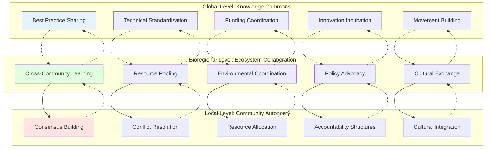

# Local ReFi Toolkit: Community Coordination Framework
**Human-Centered Approaches to Regenerative Finance Implementation**

**Related Documents:**
- [[Local_ReFi_Toolkit_Master_Implementation_Plan|Master Implementation Plan]]
- [[Local_ReFi_Toolkit_Technical_Specifications|Technical Specifications & Implementation]]
- [[Local_ReFi_Toolkit_Integration_Strategy|Integration & Interoperability Strategy]]
- [[Local_ReFi_Toolkit_Resource_Mapping_Strategy|Resource Mapping & Knowledge Connection]]

**Parent Project:** [[250701 Regen Coordination]]

---

## Executive Summary

While technical specifications provide the infrastructure for ReFi implementation, successful adoption depends fundamentally on human and community dynamics. This framework addresses the social, cultural, and organizational aspects of local regenerative finance initiatives, offering guidance for community builders, organizers, and ecosystem stewards working to bridge Web3 innovations with grassroots regenerative movements.

The framework emerges from extensive coordination work across the ReFi ecosystem, including insights from Regen Coordination Council discussions, successful local node implementations, and lessons learned from global funding rounds. It emphasizes **cosmo-local collaboration**—sharing knowledge and governance frameworks globally while grounding their application within specific community contexts and wisdom.

---

## Core Principles for Community-Centered ReFi

### 1. **Community-First, Technology-Second**
- **Start with existing relationships and trust networks**: Build upon established community bonds rather than imposing new technical systems
- **Meet communities where they are**: Adapt Web3 tools to existing workflows and priorities, not the reverse
- **Cultural sensitivity**: Respect local governance traditions, decision-making processes, and economic practices
- **Regenerative storytelling**: Frame ReFi tools within narratives that resonate with community values and aspirations

### 2. **Progressive Complexity and Accessibility**
- **Multiple entry points**: Design engagement pathways for Web3 novices, environmentally-focused practitioners, and experienced ReFi builders
- **Educational scaffolding**: Provide layered learning experiences from basic concepts to advanced implementation
- **Language accessibility**: Translate both technical content and cultural concepts across linguistic and conceptual boundaries
- **Visual communication**: Use infographics, diagrams, and visual frameworks to make complex systems comprehensible

### 3. **Sovereignty and Self-Determination**
- **Community autonomy**: Support communities in defining their own regenerative goals and implementation strategies
- **Governance flexibility**: Offer multiple governance models rather than prescriptive structures
- **Resource control**: Ensure communities maintain control over their data, assets, and decision-making processes
- **Cultural preservation**: Honor and strengthen local knowledge systems while integrating beneficial innovations

### 4. **Collaborative Learning and Knowledge Commons**
- **Peer-to-peer knowledge sharing**: Facilitate direct connections between communities implementing similar initiatives
- **Open source approach**: Share resources, templates, and learnings freely across the ecosystem
- **Continuous iteration**: Build feedback loops for ongoing improvement and adaptation
- **Cross-pollination**: Enable knowledge transfer between different bioregions and cultural contexts

---

## Community Engagement Strategy

### Target Community Segments

#### **1. Web3 Novices in Regenerative Work**
*Environmental activists, local organizers, traditional sustainability professionals*

**Engagement Approach:**
- **Trust-building first**: Begin with in-person meetups and relationship development
- **Practical value demonstration**: Show tangible benefits before introducing technical complexity
- **Educational partnerships**: Collaborate with existing environmental and social justice organizations
- **Mentorship programs**: Pair newcomers with experienced ReFi practitioners
- **Success storytelling**: Share relatable case studies from similar communities

**Key Resources Needed:**
- Simplified explanatory materials
- Basic Web3 literacy workshops
- One-on-one onboarding support
- Community ambassadors and translators
- Connection to local environmental initiatives

#### **2. Web3-Aware ReFi Practitioners**
*Greenpill stewards, local node leaders, existing ReFi community members*

**Engagement Approach:**
- **Advanced optimization strategies**: Focus on scaling and improving existing initiatives
- **Cross-community collaboration**: Facilitate knowledge sharing between experienced practitioners
- **Leadership development**: Support community members in becoming local ecosystem stewards
- **Innovation laboratories**: Create spaces for experimenting with new tools and approaches
- **Policy advocacy**: Engage with local government and institutional partners

**Key Resources Needed:**
- Advanced implementation guides
- Technical troubleshooting support
- Networking and collaboration platforms
- Innovation funding opportunities
- Policy advocacy toolkits

### Community Onboarding Framework

```mermaid
flowchart LR
    subgraph "Phase 1: Relationship Building (1-3 months)"
        A[Community Mapping] --> B[Listening Sessions]
        B --> C[Trust Establishment]
        C --> D[Capacity Assessment]
        D --> E[Vision Alignment]
    end
    
    subgraph "Phase 2: Foundation Setting (3-6 months)"
        F[Educational Workshops] --> G[Pilot Project Selection]
        G --> H[Team Formation]
        H --> I[Governance Design]
        I --> J[Resource Mobilization]
    end
    
    subgraph "Phase 3: Implementation (6-12 months)"
        K[Pilot Deployment] --> L[Iterative Improvement]
        L --> M[Skill Development]
        M --> N[Network Integration]
        N --> O[Impact Documentation]
    end
    
    subgraph "Phase 4: Scaling (Year 2+)"
        P[Initiative Expansion] --> Q[Leadership Transition]
        Q --> R[Knowledge Sharing]
        R --> S[Policy Engagement]
        S --> T[Regenerative Integration]
    end
    
    E --> F
    J --> K
    O --> P
    
    style A fill:#FFE4E1
    style F fill:#E6F3FF
    style K fill:#E0FFE0
    style P fill:#FFF8DC
```

#### **Phase 1: Relationship Building (Months 1-3)**
- **Community mapping**: Identify key stakeholders, existing initiatives, and potential allies
- **Listening sessions**: Understand local needs, priorities, and cultural dynamics
- **Trust establishment**: Demonstrate commitment to community benefit over external agenda
- **Capacity assessment**: Evaluate existing skills, resources, and readiness for ReFi adoption
- **Vision alignment**: Co-create shared understanding of regenerative goals and Web3 potential

#### **Phase 2: Foundation Setting (Months 3-6)**
- **Educational workshops**: Provide accessible introduction to ReFi concepts and tools
- **Pilot project selection**: Choose initial implementations that demonstrate value with minimal risk
- **Team formation**: Identify and develop local leadership and technical capacity
- **Governance design**: Establish decision-making processes that honor community values
- **Resource mobilization**: Secure initial funding and technical support for implementation

#### **Phase 3: Implementation and Learning (Months 6-12)**
- **Pilot deployment**: Launch initial ReFi tools with extensive community support
- **Iterative improvement**: Gather feedback and adapt implementation based on community experience
- **Skill development**: Build local technical and organizational capacity for sustainability
- **Network integration**: Connect with broader ReFi ecosystem for learning and collaboration
- **Impact documentation**: Track outcomes and share learnings with other communities

#### **Phase 4: Scaling and Innovation (Year 2+)**
- **Initiative expansion**: Add new tools and approaches based on community priorities
- **Leadership transition**: Support community members in taking full ownership of initiatives
- **Knowledge sharing**: Contribute insights and resources back to global ReFi commons
- **Policy engagement**: Work with local institutions to create supportive regulatory environments
- **Regenerative integration**: Embed ReFi tools into broader community regeneration strategies

---

## Coordination Mechanisms and Governance

### Multi-Scale Coordination Framework

#### **Local Level: Community Autonomy**
- **Consensus building**: Facilitate inclusive decision-making processes that honor diverse perspectives
- **Conflict resolution**: Establish mechanisms for addressing disagreements and managing tensions
- **Resource allocation**: Create transparent and equitable systems for distributing funding and support
- **Accountability structures**: Develop community-controlled evaluation and feedback systems
- **Cultural integration**: Embed ReFi practices within existing community traditions and ceremonies

#### **Bioregional Level: Ecosystem Collaboration**
- **Cross-community learning**: Facilitate knowledge sharing between communities in shared bioregions
- **Resource pooling**: Enable collaborative approaches to funding, infrastructure, and technical support
- **Environmental coordination**: Align ReFi initiatives with broader ecological restoration efforts
- **Policy advocacy**: Coordinate regional advocacy for supportive regulatory frameworks
- **Cultural exchange**: Support inter-community relationship building and mutual aid

#### **Global Level: Knowledge Commons**
- **Best practice sharing**: Document and disseminate successful approaches across the global network
- **Technical standardization**: Develop interoperable systems while preserving local customization
- **Funding coordination**: Align global funding flows with grassroots priorities and needs
- **Innovation incubation**: Support development of new tools and approaches through collaborative R&D
- **Movement building**: Strengthen connections between ReFi communities and broader regenerative movements

### Governance Models and Frameworks

#### **Consent-Based Decision Making**
- **Proposal development**: Collaborative process for generating and refining community initiatives
- **Consent evaluation**: Focus on removing objections rather than requiring enthusiasm from all participants
- **Circle governance**: Nested circles of responsibility with clear domains and delegated authority
- **Transparency mechanisms**: Open access to decision-making processes and rationale
- **Continuous adaptation**: Regular review and modification of governance systems based on experience

#### **Participatory Resource Allocation**
- **Community prioritization**: Democratic processes for identifying funding priorities and recipients
- **Quadratic funding integration**: Use QF mechanisms while maintaining community control over criteria
- **Impact evaluation**: Community-controlled assessment of outcomes and effectiveness
- **Wealth redistribution**: Intentional strategies for addressing inequality and concentrating benefits
- **Regenerative investing**: Align investment decisions with ecological and social restoration goals

---

## Cultural Integration and Values Alignment

### Regenerative Culture Development

#### **Shifting from Extractive to Regenerative Mindsets**
- **Relationship-centric thinking**: Prioritize connections and mutual benefit over individual gain
- **Long-term perspective**: Decision-making that considers seven generations of impact
- **Abundance consciousness**: Move from scarcity-based competition to collaborative abundance creation
- **Ecological integration**: Understanding human communities as part of broader ecological systems
- **Justice orientation**: Center equity, inclusion, and reparative approaches in all initiatives

#### **Cultural Practice Integration**
- **Ceremony and ritual**: Incorporate meaningful practices that honor transitions and achievements
- **Storytelling traditions**: Use narrative to convey values, share knowledge, and build identity
- **Artistic expression**: Support creative approaches to communicating ReFi concepts and celebrating successes
- **Food and gathering**: Center shared meals and community gathering in coordination activities
- **Land connection**: Ground ReFi work in specific places and ecological relationships

### Communication and Knowledge Sharing

#### **Multi-Modal Communication Strategies**
- **Visual storytelling**: Use infographics, videos, and visual maps to convey complex information
- **Oral tradition**: Honor spoken knowledge sharing through presentations, podcasts, and conversations
- **Written documentation**: Create accessible written resources while respecting different literacy levels
- **Embodied learning**: Hands-on workshops, site visits, and experiential education opportunities
- **Digital platforms**: Leverage online tools while maintaining primacy of in-person relationship building

#### **Language and Translation**
- **Linguistic accessibility**: Provide materials in local languages and work with community translators
- **Cultural translation**: Adapt concepts and frameworks to local cultural contexts and worldviews
- **Technical simplification**: Express complex technical concepts in accessible, jargon-free language
- **Multiple literacy levels**: Create materials appropriate for different educational backgrounds
- **Youth engagement**: Develop age-appropriate resources and engagement strategies for emerging leaders

---

## Community Building and Network Development

### Relationship-Centered Approach

#### **Trust Building Strategies**
- **Consistent presence**: Maintain long-term commitment to community relationships beyond project timelines
- **Transparent communication**: Share decision-making processes, funding sources, and organizational motivations
- **Mutual benefit**: Ensure all parties receive value from collaboration, avoiding extractive relationships
- **Cultural humility**: Approach communities as learners rather than experts, honoring local knowledge
- **Accountability mechanisms**: Create structures for community members to provide feedback and address concerns

#### **Network Weaving and Connection Building**
- **Connector identification**: Identify and support natural community connectors and relationship builders
- **Cross-community exchange**: Facilitate visits, exchanges, and collaboration between different communities
- **Intergenerational engagement**: Bridge traditional knowledge holders with youth innovators
- **Professional development**: Support community members in developing skills and advancing careers in ReFi
- **Celebration and recognition**: Acknowledge contributions and achievements through appropriate cultural forms

### Organizational Development and Capacity Building

#### **Leadership Development**
- **Distributed leadership**: Cultivate multiple leaders rather than relying on single individuals
- **Skill diversification**: Develop both technical and social/emotional intelligence capabilities
- **Succession planning**: Ensure knowledge transfer and continuity of initiatives
- **Conflict mediation**: Train community members in conflict resolution and restorative justice practices
- **External representation**: Support community members in representing initiatives in broader networks

#### **Institutional Strengthening**
- **Legal framework navigation**: Support communities in understanding regulatory requirements and opportunities
- **Financial management**: Build capacity for transparent and effective resource management
- **Partnership development**: Foster relationships with supportive organizations and institutions
- **Risk management**: Develop strategies for addressing technical, financial, and social risks
- **Sustainability planning**: Create long-term strategies for maintaining initiatives beyond initial funding

---

## Impact Measurement and Learning

### Community-Controlled Evaluation

#### **Participatory Monitoring Systems**
- **Community-defined metrics**: Support communities in identifying their own success indicators
- **Story-based evaluation**: Capture qualitative impacts through narrative and storytelling approaches
- **Peer evaluation**: Enable communities to learn from and assess each other's work
- **Continuous feedback loops**: Build ongoing learning and adaptation into all initiatives
- **Cultural appropriate measurement**: Respect different ways of knowing and evaluating success

#### **Learning and Adaptation Framework**
- **Experiment mindset**: Frame initiatives as learning experiments rather than predetermined solutions
- **Failure celebration**: Create safe spaces for sharing challenges and lessons learned
- **Knowledge harvesting**: Regular reflection and documentation of insights and learnings
- **Cross-community learning**: Facilitate sharing of experiences and adaptations between communities
- **Innovation incubation**: Support development of new approaches based on community-identified needs

### Network-Level Learning and Knowledge Commons

#### **Knowledge Sharing Infrastructure**
- **Documentation systems**: Create accessible ways for communities to share their experiences and resources
- **Learning exchanges**: Facilitate regular opportunities for cross-community learning and collaboration
- **Best practice identification**: Identify and disseminate successful approaches while respecting context specificity
- **Innovation laboratories**: Create spaces for collaborative development of new tools and approaches
- **Research partnerships**: Support community-controlled research that advances broader understanding

#### **Movement Learning and Strategy**
- **Ecosystem mapping**: Maintain understanding of broader ReFi landscape and strategic opportunities
- **Policy learning**: Track regulatory developments and advocacy opportunities across different jurisdictions
- **Technology assessment**: Evaluate new technical developments for community relevance and appropriateness
- **Partnership evaluation**: Assess collaboration opportunities with other movements and organizations
- **Vision evolution**: Continuously refine shared understanding of regenerative futures and pathways

---

## Resource Mobilization and Sustainability

### Funding Strategy and Financial Sovereignty

#### **Diversified Funding Approaches**
- **Community investment**: Support communities in mobilizing local resources and investment
- **Grant coordination**: Align external grant funding with community priorities and governance
- **Earned revenue**: Develop sustainable business models that generate ongoing operational funding
- **Cooperative finance**: Explore credit unions, community loan funds, and mutual aid systems
- **Regenerative investment**: Attract impact investors aligned with long-term regenerative goals

#### **Financial Literacy and Management**
- **Transparent budgeting**: Maintain open and accessible financial management and reporting
- **Community investment**: Build local capacity for financial management and investment decision-making
- **Risk management**: Develop strategies for managing financial and operational risks
- **Value creation**: Focus on creating genuine value for communities rather than extractive wealth generation
- **Wealth redistribution**: Intentionally design financial flows to address inequality and concentrate benefits

### Technical Infrastructure and Support

#### **Community-Controlled Technology**
- **Local hosting**: Support communities in maintaining control over their digital infrastructure
- **Open source prioritization**: Use and contribute to open source technologies that support community sovereignty
- **Technical literacy**: Build local capacity for maintaining and adapting technical systems
- **Security and privacy**: Ensure community data and resources are protected from external exploitation
- **Interoperability**: Maintain connections with broader networks while preserving local autonomy

#### **Support Network Development**
- **Peer mentorship**: Connect communities with others who have implemented similar initiatives
- **Technical assistance**: Provide access to specialized technical support when needed
- **Collaborative infrastructure**: Share resources and infrastructure costs across community networks
- **Innovation support**: Provide funding and support for community-identified technical innovations
- **Emergency response**: Develop mutual aid systems for addressing technical and operational crises

---

## Implementation Roadmap and Next Steps

### Immediate Priorities (Next 30-90 Days)

#### **Community Engagement and Relationship Building**
- [ ] Identify and connect with key community organizers and regenerative practitioners in target bioregions
- [ ] Conduct listening sessions to understand local priorities, challenges, and opportunities
- [ ] Develop culturally appropriate communication materials and educational resources
- [ ] Establish partnerships with existing environmental and social justice organizations
- [ ] Create mechanisms for ongoing community feedback and input into toolkit development

#### **Resource Development and Capacity Building**
- [ ] Develop simplified educational materials for Web3 novices in regenerative work
- [ ] Create advanced resources for experienced ReFi practitioners seeking to scale their impact
- [ ] Establish mentorship and peer learning networks connecting communities across bioregions
- [ ] Develop funding strategies that prioritize community control and long-term sustainability
- [ ] Build technical support networks and infrastructure for community-controlled implementation

### Medium-Term Goals (3-12 Months)

#### **Pilot Implementation and Learning**
- [ ] Launch pilot implementations in 3-5 diverse communities with extensive support and evaluation
- [ ] Develop and test community-controlled evaluation and learning systems
- [ ] Create cross-community learning and collaboration opportunities
- [ ] Establish sustainable funding mechanisms aligned with regenerative principles
- [ ] Build local leadership and technical capacity for long-term initiative sustainability

#### **Network Development and Scaling**
- [ ] Expand network to 10+ active communities across different bioregions and cultural contexts
- [ ] Develop standardized but customizable resources for community onboarding and implementation
- [ ] Create policy advocacy strategies and tools for supportive regulatory environments
- [ ] Establish innovation laboratories for developing new community-identified tools and approaches
- [ ] Build connections with broader regenerative and social justice movements

### Long-Term Vision (1-3 Years)

#### **Movement Building and System Change**
- [ ] Support emergence of bioregional networks of ReFi communities with shared governance and resources
- [ ] Influence policy development to create supportive regulatory frameworks for regenerative finance
- [ ] Integrate ReFi tools into broader community development and regenerative initiatives
- [ ] Develop sustainable career pathways for community members working in regenerative finance
- [ ] Create replicable models for community-controlled economic development using Web3 tools

---

## Success Metrics and Evaluation Framework

### Community-Defined Success Indicators

#### **Quantitative Measures**
- Number of communities actively implementing ReFi initiatives with community control
- Retention rate of communities engaging with ReFi tools beyond initial funding periods
- Local economic activity generated and retained within Web3 systems
- Number of community members developing leadership and technical capabilities
- Cross-community collaboration instances and resource sharing activities

#### **Qualitative Indicators**
- Community satisfaction with ReFi tool integration and impact on local priorities
- Strengthening of local relationships, trust, and social cohesion through ReFi initiatives
- Enhancement of community sovereignty and self-determination through Web3 tools
- Integration of ReFi practices with broader regenerative and justice work
- Cultural vitality and preservation supported through regenerative economic activities

### Learning and Adaptation Metrics

#### **Knowledge Development**
- Quality and accessibility of educational resources developed through community collaboration
- Effectiveness of different onboarding approaches across diverse cultural contexts
- Innovation rate in developing new tools and approaches based on community needs
- Cross-community learning and knowledge sharing frequency and quality
- Integration of traditional knowledge with Web3 innovations

#### **Movement Building**
- Growth in broader regenerative finance ecosystem and alignment with justice movements
- Policy influence and regulatory environment improvement for community-controlled ReFi
- Partnership development with aligned organizations and movements
- Media representation and public understanding of community-controlled regenerative finance
- Integration of ReFi approaches into academic and professional development curricula

---

## Conclusion

The success of the Local ReFi Toolkit depends not merely on technical functionality, but fundamentally on its ability to strengthen communities, honor local knowledge, and support genuine regeneration. This Community Coordination Framework provides the social and organizational infrastructure necessary for transforming Web3 innovations into tools for community empowerment and ecological restoration.

By centering relationship building, cultural sensitivity, and community sovereignty, this framework ensures that ReFi implementations serve local priorities while contributing to a global movement for regenerative transformation. The approach recognizes that lasting change emerges from communities themselves, with external supporters playing facilitating rather than directing roles.

The framework's emphasis on learning, adaptation, and knowledge sharing creates opportunities for continuous improvement while respecting the unique context and wisdom of each community. Through this approach, the Local ReFi Toolkit becomes not just a collection of technical resources, but a catalyst for community-controlled economic development and regenerative practice.

As communities around the world face increasing challenges from climate change, economic inequality, and social fragmentation, community-controlled regenerative finance offers pathways toward resilience, justice, and ecological restoration. This framework provides the human-centered foundation necessary for realizing that potential.

---

**Document Status**: Draft for Community Review  
**Next Review**: To be scheduled with community partners  
**Contributors**: Synthesized from insights by Regen Coordination Council, Local ReFi practitioners, and community partners  
**Date**: January 2025  
**Living Document**: This framework will evolve based on community feedback and implementation experience 