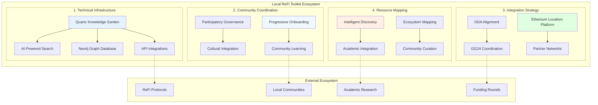
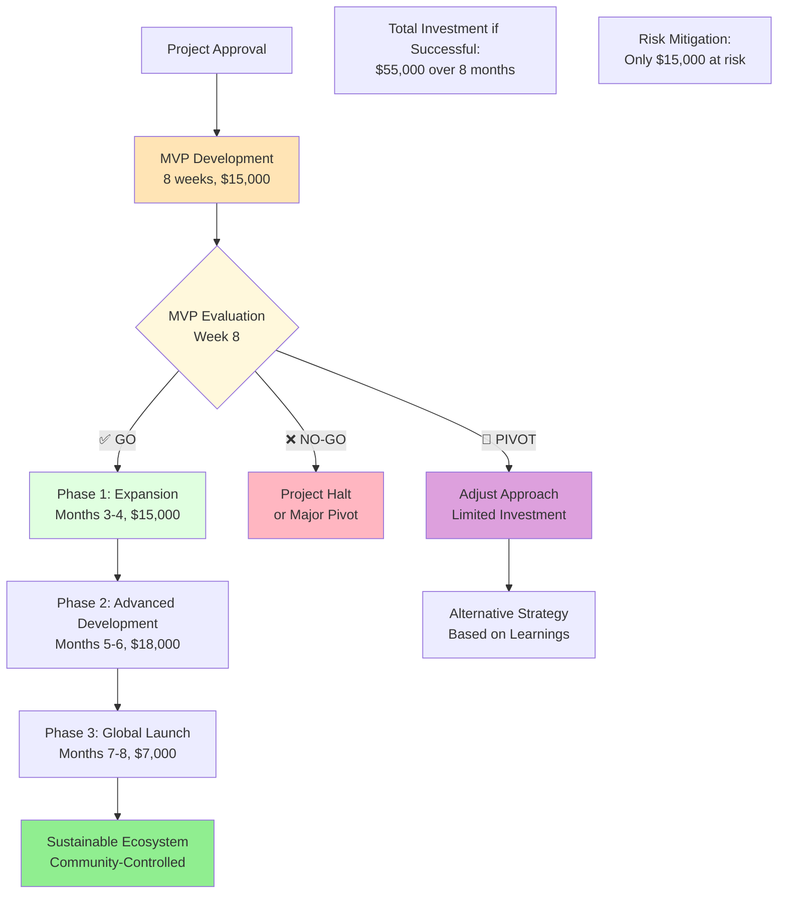

# Local ReFi Toolkit: Master Implementation Plan
**Comprehensive Strategy for Regenerative Finance Knowledge Commons**

**Related Documents:**
- [[Local_ReFi_Toolkit_MVP_Plan|MVP Implementation Plan]] ⭐ **IMMEDIATE NEXT STEP**
- [[Local_ReFi_Toolkit_Technical_Specifications|Technical Specifications & Implementation]]
- [[Local_ReFi_Toolkit_Community_Coordination_Framework|Community Coordination Framework]]
- [[Local_ReFi_Toolkit_Integration_Strategy|Integration & Interoperability Strategy]]
- [[Local_ReFi_Toolkit_Resource_Mapping_Strategy|Resource Mapping & Knowledge Connection]]
- [[Local_ReFi_Toolkit_Synthesis|Strategic Synthesis (Council Discussions)]]

**Parent Project:** [[250701 Regen Coordination]]

---

## Executive Summary

The Local ReFi Toolkit represents a transformative initiative to create the definitive knowledge infrastructure for regenerative finance implementation worldwide. This master plan synthesizes four strategic pillars—**Technical Infrastructure**, **Community Coordination**, **Integration & Interoperability**, and **Resource Mapping**—into a unified implementation strategy that bridges Web3 innovation with grassroots regenerative movements.

**Vision**: Transform scattered ReFi knowledge into an intelligent, interconnected ecosystem that enables any community to implement regenerative finance solutions appropriate to their context and needs.

**Strategic Approach**: Rather than building competing platforms, we recommend **convergence with Ethereum Localism** to create shared infrastructure that amplifies both movements while reducing costs and fragmentation.


---

## Strategic Architecture Overview

### Four Integrated Pillars



#### **1. Technical Infrastructure Foundation**
*Base platform capabilities and architecture*

**Core Components:**
- Quartz-based knowledge garden (leveraging ethereumlocalism.xyz)
- Neo4j graph database for knowledge relationships
- AI-powered semantic search and recommendations
- API integrations with Karma GAP, Gitcoin, and protocol ecosystems
- Multi-language support and mobile optimization

**Key Innovation**: Intelligent knowledge graph that learns from user interactions and community contributions

#### **2. Community Coordination Framework**
*Human-centered approaches to regenerative finance implementation*

**Core Components:**
- Progressive onboarding for Web3 novices and experienced practitioners
- Multi-scale coordination (local → bioregional → global)
- Cultural integration and values alignment systems
- Participatory governance and consent-based decision making
- Community-controlled evaluation and learning frameworks

**Key Innovation**: Relationship-first approach that honors local knowledge while enabling global collaboration

#### **3. Integration & Interoperability Strategy**
*Platform convergence and ecosystem coordination*

**Core Components:**
- Strategic alignment with Ethereum Localism knowledge garden
- API architecture for cross-platform data sharing
- DDA and GG24 funding round coordination
- Unified contributor network and recognition systems
- Cross-platform event and community coordination

**Key Innovation**: Platform convergence model that eliminates fragmentation while preserving specialized focus

#### **4. Resource Mapping & Knowledge Connection**
*Intelligent discovery and navigation systems*

**Core Components:**
- Comprehensive ecosystem mapping (academic, protocol, community, policy layers)
- AI-powered research assistant and learning path generation
- Visual knowledge maps and interactive navigation
- Academic research integration and translation pipelines
- Community-driven curation and quality assurance

**Key Innovation**: Living knowledge ecosystem that actively facilitates discovery and implementation

---

## Unified Implementation Strategy

### Convergence with Ethereum Localism

**Strategic Decision**: Integrate Local ReFi Toolkit as dedicated section within ethereumlocalism.xyz rather than building competing platform.

**Platform Structure:**
```
ethereumlocalism.xyz/
├── introduction/
├── library/
├── resources/
├── action-kit/
│   ├── local-refi-toolkit/           # INTEGRATED SECTION
│   │   ├── playbooks/                # Technical: Protocol-specific guides
│   │   ├── case-studies/             # Community: Real-world implementations
│   │   ├── community-coordination/   # Community: Framework and workflows
│   │   ├── impact-measurement/       # Resource Mapping: Evaluation systems
│   │   ├── resource-discovery/       # Resource Mapping: Search and navigation
│   │   └── research-integration/     # Resource Mapping: Academic bridge
│   └── existing-action-resources/
└── community/
```

**Integration Benefits:**
- **$23,000 cost savings** through shared infrastructure
- **Immediate access** to established Ethereum Localism community
- **Unified platform** eliminates user confusion and fragmentation
- **Amplified impact** through combined community networks
- **Aligned messaging** supporting both ReFi and Ethereum Localism movements

### Phased Development Roadmap

```mermaid
timeline
    title Local ReFi Toolkit Implementation Timeline
    
    section MVP Phase: Validation
        Week 1-2   : Partnership Setup
                   : Technical Foundation
                   : Content Planning
        Week 3-4   : Playbook Creation
                   : Case Study Development
                   : Basic Platform Setup
        Week 5-6   : Platform Integration
                   : Community Features
                   : User Testing
        Week 7-8   : Beta Testing
                   : Public Launch
                   : Validation Assessment
    
    section Phase 1: Foundation (Post-MVP)
        Month 3    : Partnership Expansion
                   : Technical Enhancement
                   : Resource Inventory
                   : Governance Structure
        Month 4    : Content Expansion
                   : API Integrations
                   : Community Scaling
                   : Quality Systems
    
    section Phase 2: Core Development  
        Month 5    : AI Implementation
                   : Advanced Search
                   : Pilot Communities
                   : Academic Integration
        Month 6    : Platform Optimization
                   : Analytics Dashboard
                   : Multi-language Support
                   : Performance Scaling
    
    section Phase 3: Advanced Features
        Month 7    : Visual Navigation
                   : Knowledge Graphs
                   : Advanced Analytics
                   : Policy Integration
        Month 8    : Full Ecosystem Launch
                   : Sustainability Model
                   : Impact Measurement
                   : Long-term Planning
```

#### **MVP Phase: Validation & Foundation (Weeks 1-8)**
*Rapid validation of core concept and basic functionality*

**Prerequisites**: MVP successful completion with positive validation metrics
- 200+ active users, 10+ implementations, positive community feedback
- Technical integration validated with Ethereum Localism
- Clear demand demonstrated for expanded functionality

**Key Outputs**: 
- Validated platform integration model
- 10 essential playbooks with usage data
- 5 case studies with implementation feedback  
- Basic community engagement and contribution workflows
- Partnership framework with Ethereum Localism established

**Decision Point**: Go/No-Go evaluation for full implementation based on MVP success metrics

#### **Phase 1: Expansion & Enhancement (Months 3-4) - POST-MVP**
*Scale validated concept and establish robust foundation*

**Technical Infrastructure:**
- [ ] Scale MVP platform based on user feedback and performance data
- [ ] Implement advanced content management system with versioning
- [ ] Deploy comprehensive API architecture for external integrations
- [ ] Establish robust analytics and monitoring infrastructure
- [ ] Setup automated backup and disaster recovery systems

**Community Coordination:**
- [ ] Expand successful MVP communities to 5+ active pilot implementations
- [ ] Establish formal governance structure based on MVP learnings
- [ ] Create comprehensive onboarding and training programs
- [ ] Develop community moderator and expert reviewer networks
- [ ] Implement contributor recognition and incentive systems

**Integration Strategy:**
- [ ] Formalize partnership agreements with Ethereum Localism and other platforms
- [ ] Implement cross-platform user authentication and profile synchronization
- [ ] Establish automated content syndication workflows
- [ ] Create shared event calendar and coordination systems
- [ ] Develop GG24 funding round integration features

**Resource Mapping:**
- [ ] Expand resource database to 1000+ curated resources
- [ ] Implement Neo4j graph database for intelligent connections
- [ ] Deploy basic AI-powered semantic search functionality
- [ ] Establish academic research integration pipelines
- [ ] Create community curation and quality assurance workflows

**Phase 1 Deliverables:**
- Scaled platform supporting 500+ active users
- 25+ playbooks across all difficulty levels
- 15+ verified case studies with implementation data
- 1000+ intelligently connected resources
- Formal governance and community management structure

#### **Phase 2: Advanced Development & AI Integration (Months 5-6)**
*Deploy sophisticated functionality and intelligence systems*

**Technical Infrastructure:**
- [ ] Advanced AI-powered research assistant and learning path generation
- [ ] Machine learning optimization based on user behavior patterns
- [ ] Sophisticated analytics dashboard with predictive insights
- [ ] Multi-language support implementation (Spanish, Portuguese, French)
- [ ] Enterprise-grade security and compliance features

**Community Coordination:**
- [ ] Scale to 10+ active pilot communities across diverse bioregions
- [ ] Advanced mentorship and expert networks with reputation systems
- [ ] Cultural localization and regional adaptation programs
- [ ] Sophisticated community governance and decision-making tools
- [ ] Cross-community collaboration and resource sharing systems

**Integration Strategy:**
- [ ] Full ecosystem API integration with 5+ major partner platforms
- [ ] Advanced user personalization and recommendation engines
- [ ] Comprehensive GG24 and future funding round automation
- [ ] Real-time content synchronization across partner networks
- [ ] Integrated event management and community coordination platform

**Resource Mapping:**
- [ ] Advanced AI research assistant with natural language processing
- [ ] Comprehensive academic database integration and research translation
- [ ] Live protocol documentation synchronization and accuracy verification
- [ ] Interactive visual knowledge maps with graph navigation
- [ ] Sophisticated community curation with quality scoring algorithms

**Phase 2 Deliverables:**
- AI-enhanced platform supporting 1000+ active users
- 40+ playbooks with advanced implementation tracking
- 10+ pilot communities with documented success metrics
- 2000+ intelligently connected resources with quality scores
- Advanced research translation and academic integration pipeline

#### **Phase 3: Ecosystem Integration & Global Launch (Months 7-8)**
*Deploy full ecosystem capabilities and achieve sustainable scale*

**Technical Infrastructure:**
- [ ] Full interactive visual navigation with Kumu knowledge maps integration
- [ ] AI-powered personalized learning journeys with adaptive recommendations
- [ ] Complete multi-language ecosystem (5+ languages with cultural localization)
- [ ] Enterprise-grade features for municipal and institutional adoption
- [ ] Comprehensive analytics with predictive modeling and impact forecasting

**Community Coordination:**
- [ ] Global network of 20+ thriving communities across all major bioregions
- [ ] Advanced policy advocacy and regulatory engagement frameworks
- [ ] Established innovation laboratories and research collaboration hubs
- [ ] Comprehensive leadership development and mentorship programs
- [ ] Fully sustainable community-controlled governance and funding model

**Integration Strategy:**
- [ ] Complete ecosystem integration with 10+ major ReFi and Web3 platforms
- [ ] Advanced partnership network with academic, municipal, and corporate sectors
- [ ] Sophisticated governance systems with community ownership transition
- [ ] Diversified revenue streams ensuring long-term sustainability
- [ ] Full integration with GG25 and future funding ecosystem developments

**Resource Mapping:**
- [ ] Fully interactive knowledge ecosystem with visual exploration capabilities
- [ ] Advanced predictive analytics for emerging trends and resource needs
- [ ] Comprehensive academic-practitioner bridge with automated research translation
- [ ] Global cross-institutional collaboration platform and resource exchange
- [ ] Advanced impact verification and outcome tracking with blockchain integration

**Phase 3 Deliverables:**
- Global platform supporting 2000+ active users across 20+ communities
- 60+ comprehensive playbooks with verified success across diverse contexts
- Thriving network of 20+ communities with documented regenerative impact
- 3000+ intelligently connected resources with advanced quality verification
- Fully sustainable, community-controlled ecosystem with proven impact model

---

## Resource Requirements & Budget Allocation

### Consolidated Budget Overview

**Total Investment Required**: $55,000 (8 months)
*MVP-First Approach: $15,000 validation + $40,000 full implementation*
*Note: $23,000 savings achieved through Ethereum Localism partnership*

#### **MVP Phase Investment** ($15,000 - 8 weeks)
**Objective**: Rapid validation and foundation establishment
- **Development**: $9,000 (Platform integration, basic features)
- **Content**: $4,000 (10 playbooks, 5 case studies)
- **Community & Launch**: $2,000 (Beta testing, marketing)

**Risk Mitigation**: Low initial investment with clear go/no-go decision gate

#### **Full Implementation Investment** ($40,000 - 6 months post-MVP)
**Prerequisite**: Successful MVP completion and validation

**Development Resources** ($25,000)
- **Advanced Platform Development**: $10,000 (AI systems, graph database, advanced features)
- **API & Integration Development**: $6,000 (Comprehensive ecosystem integrations)
- **Visual Analytics & Navigation**: $4,000 (Knowledge maps, interactive visualizations)
- **Multi-language & Localization**: $3,000 (International expansion capabilities)
- **Enterprise & Security Features**: $2,000 (Municipal-grade security and compliance)

**Content & Knowledge Development** ($10,000)
- **Advanced Content Creation**: $6,000 (30+ additional playbooks, research integration)
- **Community Scaling**: $2,500 (Mentor networks, advanced community features)
- **Quality & Verification Systems**: $1,500 (Advanced curation, impact tracking)

**Community & Ecosystem Development** ($5,000)
- **Global Community Expansion**: $2,500 (Multi-bioregional scaling, cultural adaptation)
- **Partnership & Integration**: $1,500 (Ecosystem partnerships, institutional relationships)
- **Sustainability & Governance**: $1,000 (Revenue models, community ownership transition)

### Resource Allocation by Phase

**MVP Phase** ($15,000): Rapid validation and foundation (Weeks 1-8)
**Phase 1** ($15,000): Expansion and enhancement (Months 3-4)
**Phase 2** ($18,000): Advanced development and AI integration (Months 5-6)
**Phase 3** ($7,000): Ecosystem integration and global launch (Months 7-8)

**Total Phased Investment**: $55,000 over 8 months with clear validation gate

### Partnership Value Exchange

**Ethereum Localism Contributions** (Value: ~$23,000):
- Platform infrastructure and hosting
- Established domain authority and SEO
- Existing community network and contributor base
- Technical expertise with Quartz architecture
- Integration with broader Ethereum ecosystem

**ReFi Toolkit Contributions** (Value: ~$40,000):
- Specialized ReFi protocol knowledge and documentation
- Extensive case study library and practitioner network
- Community coordination expertise and methodologies
- Advanced impact measurement frameworks
- Direct funding for enhanced platform development

---

## Integrated Governance Framework

### Multi-Stakeholder Coordination

#### **Steering Committee**
- **ReFi DAO Representative**: Strategic direction and community coordination
- **Ethereum Localism Representative**: Platform integration and technical oversight
- **Community Coordinator**: Local implementation support and relationship management
- **Technical Lead**: Platform development and integration coordination
- **Research Coordinator**: Academic integration and knowledge mapping

#### **Advisory Council**
- **Protocol Experts**: Representatives from major ReFi protocols
- **Community Leaders**: Local node coordinators and practitioners
- **Academic Partners**: Researchers and institutional representatives
- **Policy Advocates**: Legal and regulatory expertise
- **Impact Evaluators**: Assessment and measurement specialists

### Decision-Making Framework

#### **Consent-Based Governance**
- **Proposal Process**: Open submission with community input
- **Review Cycles**: Monthly review of development priorities
- **Consent Evaluation**: Focus on removing objections rather than requiring unanimous enthusiasm
- **Escalation Process**: Clear pathways for resolving conflicts
- **Transparency**: All decisions documented and publicly accessible

#### **Resource Allocation Process**
1. **Community Needs Assessment**: Regular surveys and listening sessions
2. **Priority Setting**: Quarterly strategic planning sessions
3. **Budget Allocation**: Transparent process with community input
4. **Progress Review**: Monthly progress reports and adjustments
5. **Impact Evaluation**: Quarterly assessment of outcomes and learnings

---

## Success Metrics & Evaluation Framework

### Consolidated Success Indicators

#### **MVP Success Validation** (Week 8 Decision Gate)
- **User Engagement**: 200+ unique visitors, 50+ returning users
- **Implementation Success**: 10+ documented implementations, 3+ complete successes
- **Community Response**: Positive feedback, 5+ community contributions
- **Platform Validation**: Technical integration working, partnership established
- **Market Demand**: Clear requests for expansion and additional features

#### **Post-MVP Platform Performance Metrics** (Month 8 Targets)
- **User Engagement**: 2000+ monthly active users across 20+ communities
- **Content Quality**: 4.7+ average community rating for resources
- **Search Effectiveness**: 90%+ search success rate with AI enhancement
- **Implementation Success**: 80%+ success rate for followed playbooks
- **Platform Performance**: <1.5 second average page load times globally

#### **Community Impact Metrics**
- **Active Communities**: 20+ thriving communities implementing ReFi tools
- **Geographic Reach**: Active users in 40+ countries across all bioregions
- **Community Retention**: 85%+ of communities continue engagement beyond initial funding
- **Leadership Development**: 100+ community members develop advanced capabilities
- **Cross-Community Collaboration**: 200+ documented collaboration instances

#### **Knowledge Ecosystem Metrics**
- **Resource Coverage**: 95% of major ReFi protocols with comprehensive documentation
- **Academic Integration**: 60+ research papers translated to practical guides
- **Content Creation**: 400+ community-contributed resources with quality verification
- **Quality Assurance**: 98% of resources pass advanced community validation
- **Knowledge Connections**: 90% of resources have 5+ intelligent connections

#### **Strategic Impact Metrics**
- **Capital Mobilization**: $1M+ in local ReFi projects enabled through platform guidance
- **Policy Influence**: Resources cited in 20+ policy documents across jurisdictions
- **Academic Recognition**: 40+ academic citations of methodology and outcomes
- **Media Coverage**: Coverage in 25+ major Web3 and sustainability publications
- **Partnership Growth**: 15+ integrated partner platforms with active collaboration

### Continuous Learning & Adaptation

#### **Feedback Systems**
- **User Experience Monitoring**: Real-time analytics and user feedback
- **Community Pulse Surveys**: Quarterly community satisfaction assessment
- **Implementation Tracking**: Success/failure analysis of community implementations
- **Partner Feedback**: Regular check-ins with ecosystem partners
- **Academic Review**: Annual methodology review by academic partners

#### **Iteration Framework**
- **Monthly Reviews**: Technical performance and user experience optimization
- **Quarterly Assessments**: Community impact and strategic alignment evaluation
- **Annual Planning**: Long-term strategy refinement and goal setting
- **Continuous Improvement**: Agile development approach with rapid iteration
- **Knowledge Harvesting**: Regular documentation of learnings and insights

---

## Risk Management & Contingency Planning

### Identified Risk Categories

#### **Technical Risks**
**Platform Integration Challenges**
- *Risk*: Technical difficulties integrating with Ethereum Localism platform
- *Mitigation*: Thorough technical assessment and phased integration approach
- *Contingency*: Federated model with API-based integration as fallback

**Performance and Scalability Issues**
- *Risk*: Platform performance degradation with increased usage
- *Mitigation*: Performance testing throughout development and CDN optimization
- *Contingency*: Infrastructure scaling and alternative hosting arrangements

#### **Community Risks**
**Community Fragmentation**
- *Risk*: Resistance to platform convergence from existing communities
- *Mitigation*: Extensive community consultation and gradual transition
- *Contingency*: Dual-platform operation during transition period

**Cultural Misalignment**
- *Risk*: Toolkit approaches not resonating with diverse community contexts
- *Mitigation*: Cultural sensitivity training and local adaptation support
- *Contingency*: Community-controlled customization and alternative approaches

#### **Strategic Risks**
**Partnership Conflicts**
- *Risk*: Conflicting priorities between ReFi Toolkit and Ethereum Localism
- *Mitigation*: Clear governance structure and decision-making processes
- *Contingency*: Modular integration allowing independent operation

**Funding Sustainability**
- *Risk*: Insufficient funding for long-term maintenance and development
- *Mitigation*: Diversified funding strategy and community ownership transition
- *Contingency*: Open-source community maintenance model

### Emergency Response Protocols

#### **Technical Emergency Response**
1. **Immediate Assessment**: Rapid evaluation of issue scope and impact
2. **Communication Plan**: Transparent community communication about status
3. **Alternative Access**: Backup systems and alternative access methods
4. **Resolution Timeline**: Clear timeline for issue resolution
5. **Post-Incident Review**: Learning and improvement process

#### **Community Crisis Management**
1. **Stakeholder Engagement**: Immediate outreach to affected communities
2. **Mediation Process**: Neutral facilitation of conflict resolution
3. **Alternative Solutions**: Backup approaches and workarounds
4. **Relationship Repair**: Focused effort on rebuilding trust and alignment
5. **Process Improvement**: Updates to governance and communication processes

---

## Long-Term Vision & Evolution

### 12-Month Horizon

#### **Platform Maturation**
- **Advanced AI Capabilities**: Machine learning optimization based on user behavior
- **Global Localization**: Support for 10+ languages and cultural contexts
- **Enterprise Integration**: Municipal government and institutional adoption
- **Mobile Application**: Native mobile apps for iOS and Android
- **Offline Capability**: Downloadable content for low-connectivity environments

#### **Community Network Growth**
- **50+ Active Communities**: Diverse bioregions and cultural contexts
- **Regional Coordinators**: Local leadership in key geographic areas
- **Policy Influence**: Active engagement with regulatory development
- **Academic Integration**: University partnerships and curriculum integration
- **Corporate Adoption**: Private sector engagement and implementation

### 3-Year Strategic Vision

#### **Ecosystem Leadership**
- **Global Standard**: Recognized as definitive resource for ReFi implementation
- **Research Hub**: Leading center for regenerative finance research and development
- **Policy Influence**: Significant impact on regulatory frameworks worldwide
- **Movement Catalyst**: Central role in broader regenerative economy transition
- **Innovation Engine**: Continuous development of new tools and approaches

#### **Sustainable Impact**
- **Community Ownership**: Full transition to community-controlled governance
- **Self-Sustaining Model**: Revenue generation supporting ongoing development
- **Global Network**: Interconnected local economies using ReFi tools
- **Measured Impact**: Documented regenerative outcomes across bioregions
- **Knowledge Legacy**: Comprehensive archive of regenerative finance knowledge

---

## Call to Action & Next Steps

### Immediate Priorities (Next 30 Days)

#### **Partnership Finalization**
- [ ] **Stakeholder Alignment**: Schedule meetings with Ethereum Localism team
- [ ] **Technical Assessment**: Detailed evaluation of integration requirements
- [ ] **Community Consultation**: Gather feedback from both ReFi and Ethereum Localism communities
- [ ] **Governance Agreement**: Finalize partnership terms and decision-making processes
- [ ] **Resource Commitment**: Secure funding commitments and resource allocation

#### **Development Initiation**
- [ ] **Team Assembly**: Recruit development team and community coordinators
- [ ] **Technical Setup**: Initialize development environment and infrastructure
- [ ] **Content Planning**: Prioritize initial content creation and migration
- [ ] **Community Outreach**: Begin stakeholder engagement and relationship building
- [ ] **Timeline Confirmation**: Finalize detailed project timeline and milestones

### Community Engagement Opportunities

#### **For ReFi Practitioners**
- **Pilot Community Applications**: Apply to participate in early implementation pilots
- **Content Contribution**: Submit playbooks, case studies, and best practices
- **Expert Review**: Participate in content validation and quality assurance
- **Community Coordination**: Support local node development and coordination
- **Governance Participation**: Engage in decision-making and strategic planning

#### **For Ethereum Localism Community**
- **Platform Integration**: Support technical integration and enhancement
- **Cross-Movement Learning**: Share knowledge and collaborate across communities
- **Event Coordination**: Participate in joint workshops and conferences
- **Resource Sharing**: Contribute to shared knowledge commons development
- **Strategic Alignment**: Help align platform development with movement goals

#### **For Broader Ecosystem**
- **Research Collaboration**: Contribute academic research and translation
- **Protocol Documentation**: Provide technical documentation and updates
- **Policy Development**: Engage in regulatory and legal framework development
- **Funding Support**: Provide financial support for platform development
- **Network Amplification**: Share resources and promote adoption

---

## Conclusion

The Local ReFi Toolkit Master Implementation Plan represents an unprecedented opportunity to create unified infrastructure for the regenerative finance movement. By synthesizing technical innovation, community wisdom, strategic partnerships, and intelligent knowledge systems, we can build a platform that truly accelerates the transition to regenerative local economies worldwide.

**Key Success Factors:**
1. **Partnership Over Competition**: Convergence with Ethereum Localism eliminates fragmentation while amplifying both movements
2. **Community-Centered Approach**: Prioritizing relationships and cultural sensitivity ensures genuine adoption and impact
3. **Technical Excellence**: AI-powered knowledge systems make vast information accessible and actionable
4. **Continuous Learning**: Adaptive framework ensures platform evolves with community needs and insights

**Expected Transformation:**
- **For Communities**: Clear pathways from regenerative vision to practical implementation
- **For Practitioners**: Sophisticated tools for discovering, adapting, and sharing best practices
- **For Researchers**: Bridge between academic insights and real-world application
- **For the Movement**: Unified platform that accelerates knowledge sharing and collective learning

The convergence strategy positions this initiative not as another platform competing for attention, but as essential infrastructure that strengthens the entire ecosystem. Through careful implementation of this master plan, we can create a knowledge commons that serves as the foundation for a regenerative economy movement.

**The future of regenerative finance depends not on isolated innovations, but on our collective ability to share knowledge, support implementation, and learn together. This master plan provides the roadmap for making that future possible.**

---

---

## Implementation Strategy Update

### **MVP-First Implementation Flow**



**Key Changes Incorporated from MVP Plan:**
- **Risk-Mitigated Approach**: MVP validation before full investment commitment
- **Validated Foundation**: Build upon proven concept rather than assumptions
- **Enhanced Success Metrics**: Higher targets based on validated market demand
- **Optimized Resource Allocation**: Focused investment based on MVP learnings
- **Clear Decision Gates**: Go/No-Go evaluation prevents over-investment in unvalidated concepts

**Recommended Next Action**: Proceed with MVP implementation as outlined in [[Local_ReFi_Toolkit_MVP_Plan|MVP Plan]] for rapid validation and risk mitigation.

---

**Document Status**: Master Implementation Plan - Updated for MVP-First Approach  
**Next Review**: Upon completion of MVP validation (Week 8)  
**Implementation Start**: Begin with MVP phase pending stakeholder approval  
**Contact**: Regen Coordination Council for questions, feedback, or engagement opportunities  
**Date**: January 2025 (Updated)

**Living Document Notice**: This master plan will evolve based on MVP results, stakeholder feedback, and validated learning from implementation experience. Post-MVP updates will be shared with all stakeholders and community members. 