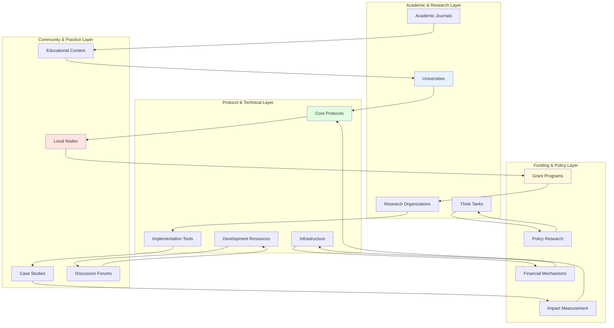
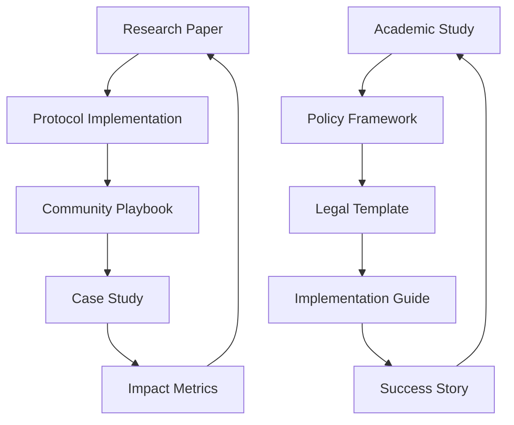
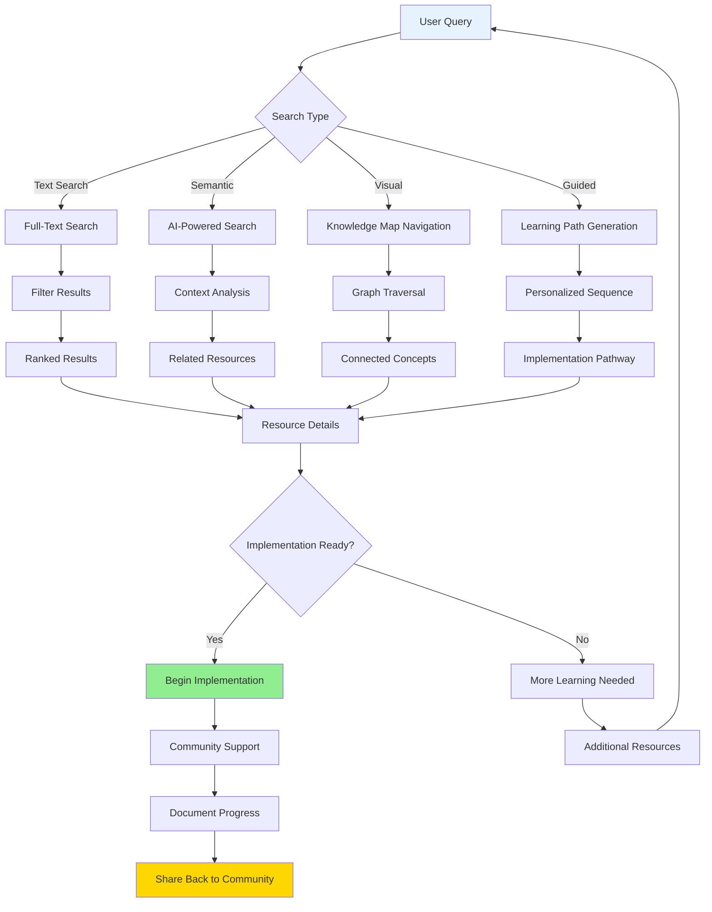

# Local ReFi Toolkit: Resource Mapping & Knowledge Connection Strategy
**Systematic Approach to Ecosystem Knowledge Discovery & Integration**

**Related Documents:**
- [[Local_ReFi_Toolkit_Master_Implementation_Plan|Master Implementation Plan]]
- [[Local_ReFi_Toolkit_Technical_Specifications|Technical Specifications & Implementation]]
- [[Local_ReFi_Toolkit_Community_Coordination_Framework|Community Coordination Framework]]
- [[Local_ReFi_Toolkit_Integration_Strategy|Integration & Interoperability Strategy]]

**Parent Project:** [[250701 Regen Coordination]]

---

## Executive Summary

The Local ReFi Toolkit's success depends not only on creating quality resources, but on making the vast ecosystem of regenerative finance knowledge discoverable, connected, and actionable. This strategy outlines approaches for mapping existing resources, creating knowledge connections, and building discovery mechanisms that help users navigate from research insights to practical implementation.

Our approach emphasizes **knowledge graph methodologies**, **community-driven curation**, and **intelligent connection systems** that bridge the gap between academic research, protocol documentation, real-world case studies, and practical implementation guides.

---

## Resource Ecosystem Mapping

### Current ReFi Knowledge Landscape



#### **Academic & Research Layer**
- **Universities**: MIT Climate CoLab, Stanford Woods Institute, Berkeley RDI
- **Research Organizations**: ReFi Research Collective, Carbon180, Climate Policy Initiative
- **Think Tanks**: Rocky Mountain Institute, New Economics Foundation, P2P Foundation
- **Academic Journals**: Nature Climate Change, Environmental Research Letters, Ecological Economics

#### **Protocol & Technical Layer**
- **Core Protocols**: Regen Network, Toucan Protocol, KlimaDAO, Moss.Earth
- **Implementation Tools**: Silvi Protocol, Atlantis, Grassroots Economics, GainForest
- **Infrastructure**: Celo, Ethereum, Arbitrum, Polygon documentation
- **Development Resources**: GitHub repositories, technical whitepapers, API documentation

#### **Community & Practice Layer**
- **Local Nodes**: ReFi DAO local chapters, Greenpill communities, BioFi projects
- **Case Studies**: Documented implementations, success stories, failure analyses
- **Educational Content**: Workshops, webinars, conferences, community-generated guides
- **Discussion Forums**: Discord servers, Telegram groups, governance forums

#### **Funding & Policy Layer**
- **Grant Programs**: Gitcoin rounds, protocol treasuries, impact investor resources
- **Policy Research**: Regulatory frameworks, legal structures, compliance guides
- **Impact Measurement**: Karma GAP projects, verified carbon credits, outcome tracking
- **Financial Mechanisms**: DeFi protocols, impact bonds, local currency systems

### Resource Categorization Framework

```typescript
interface ResourceNode {
  id: string;
  title: string;
  type: ResourceType;
  category: Category;
  difficulty: 'accessible' | 'intermediate' | 'advanced';
  stakeholders: Stakeholder[];
  protocols: Protocol[];
  regions: Region[];
  impactAreas: ImpactArea[];
  relationships: Relationship[];
  verification: VerificationStatus;
  lastUpdated: Date;
}

enum ResourceType {
  RESEARCH_PAPER = 'research_paper',
  CASE_STUDY = 'case_study',
  PLAYBOOK = 'playbook',
  PROTOCOL_DOCS = 'protocol_docs',
  COMMUNITY_GUIDE = 'community_guide',
  POLICY_DOCUMENT = 'policy_document',
  DATASET = 'dataset',
  TOOL = 'tool',
  EVENT = 'event',
  ORGANIZATION = 'organization'
}

enum Category {
  CARBON_MARKETS = 'carbon_markets',
  BIODIVERSITY = 'biodiversity',
  REGENERATIVE_AGRICULTURE = 'regenerative_agriculture',
  RENEWABLE_ENERGY = 'renewable_energy',
  CIRCULAR_ECONOMY = 'circular_economy',
  COMMUNITY_CURRENCIES = 'community_currencies',
  IMPACT_MEASUREMENT = 'impact_measurement',
  GOVERNANCE = 'governance',
  LEGAL_FRAMEWORKS = 'legal_frameworks'
}
```

---

## Knowledge Graph Architecture

### Relationship Mapping System

#### **Content Relationships**


#### **Multi-Dimensional Connections**
1. **Conceptual Links**: Shared theoretical frameworks, methodologies, principles
2. **Implementation Links**: Tools that work together, sequential implementation steps
3. **Geographic Links**: Resources relevant to specific regions or bioregions
4. **Temporal Links**: Evolution of ideas, updated versions, historical development
5. **Actor Links**: Same organizations, researchers, or communities involved
6. **Impact Links**: Similar outcomes, metrics, or regenerative goals

### Graph Database Schema

```cypher
// Create resource nodes
CREATE (r:Resource {
  id: 'resource_001',
  title: 'Community Currency Implementation Guide',
  type: 'playbook',
  difficulty: 'intermediate'
})

// Create relationship types
CREATE (r1:Resource)-[:BUILDS_UPON]->(r2:Resource)
CREATE (r1:Resource)-[:IMPLEMENTS]->(p:Protocol)
CREATE (r1:Resource)-[:RELEVANT_TO]->(reg:Region)
CREATE (r1:Resource)-[:MEASURED_BY]->(m:Metric)
CREATE (r1:Resource)-[:AUTHORED_BY]->(org:Organization)

// Complex relationship queries
MATCH (r:Resource)-[:IMPLEMENTS]->(p:Protocol)
WHERE p.name = 'Grassroots Economics'
RETURN r.title, r.type, r.difficulty
```

### Intelligent Connection Algorithms

#### **Semantic Similarity Matching**
```python
import openai
from sentence_transformers import SentenceTransformer

class ResourceConnector:
    def __init__(self):
        self.model = SentenceTransformer('all-MiniLM-L6-v2')
        
    def find_related_resources(self, target_resource, threshold=0.7):
        target_embedding = self.model.encode(target_resource.description)
        
        related = []
        for resource in self.resource_database:
            similarity = cosine_similarity(
                target_embedding, 
                resource.embedding
            )
            
            if similarity > threshold:
                related.append({
                    'resource': resource,
                    'similarity': similarity,
                    'connection_type': self.classify_connection(
                        target_resource, resource
                    )
                })
                
        return sorted(related, key=lambda x: x['similarity'], reverse=True)
    
    def classify_connection(self, resource1, resource2):
        # Use LLM to classify relationship type
        prompt = f"""
        Analyze the relationship between these two resources:
        Resource 1: {resource1.title} - {resource1.description}
        Resource 2: {resource2.title} - {resource2.description}
        
        Classify the relationship type:
        - implements: R2 implements concepts from R1
        - builds_upon: R2 extends or builds upon R1
        - alternative: R2 is an alternative approach to R1
        - prerequisite: R1 is needed before R2
        - complementary: R1 and R2 work well together
        """
        
        response = openai.Completion.create(
            model="gpt-4",
            prompt=prompt,
            max_tokens=50
        )
        
        return response.choices[0].text.strip()
```

---

## Discovery & Navigation Systems

### Multi-Modal Discovery Mechanisms



#### **1. Visual Knowledge Maps**
**Implementation**: Kumu.io integration for interactive network visualization

```javascript
// Kumu map configuration for ReFi ecosystem
const kumuConfig = {
  elements: {
    nodes: resources.map(resource => ({
      id: resource.id,
      label: resource.title,
      type: resource.type,
      category: resource.category,
      size: resource.usage_count,
      color: getColorByType(resource.type)
    })),
    
    edges: relationships.map(rel => ({
      source: rel.from,
      target: rel.to,
      type: rel.relationship_type,
      strength: rel.strength
    }))
  },
  
  filters: {
    difficulty: ['accessible', 'intermediate', 'advanced'],
    protocol: protocolList,
    region: regionList,
    impact_area: impactAreaList
  },
  
  layouts: {
    default: 'force-directed',
    clustered: 'community-detection',
    hierarchical: 'tree-layout'
  }
};
```

#### **2. AI-Powered Research Assistant**
```typescript
interface ResearchQuery {
  question: string;
  context: UserContext;
  filters: ResourceFilters;
}

interface UserContext {
  experience_level: 'beginner' | 'intermediate' | 'expert';
  role: 'researcher' | 'practitioner' | 'community_organizer' | 'policy_maker';
  location: Region;
  interests: Category[];
  current_projects: Project[];
}

class ReFiResearchAssistant {
  async findRelevantResources(query: ResearchQuery): Promise<ResourceRecommendation[]> {
    // 1. Parse natural language query
    const parsedQuery = await this.parseQuery(query.question);
    
    // 2. Context-aware filtering
    const contextFilters = this.buildContextFilters(query.context);
    
    // 3. Semantic search across resource database
    const semanticMatches = await this.semanticSearch(
      parsedQuery.keywords,
      contextFilters
    );
    
    // 4. Graph traversal for related resources
    const relatedResources = await this.findRelatedResources(semanticMatches);
    
    // 5. Personalized ranking based on user context
    const rankedResults = this.personalizeResults(relatedResources, query.context);
    
    return rankedResults;
  }
  
  async generateLearningPath(goal: string, context: UserContext): Promise<LearningPath> {
    // Create sequential learning path from goal to implementation
    const pathNodes = await this.planLearningSequence(goal, context);
    
    return {
      title: `Learning Path: ${goal}`,
      estimated_time: this.calculateEstimatedTime(pathNodes),
      difficulty_progression: this.analyzeDifficultyProgression(pathNodes),
      steps: pathNodes.map((node, index) => ({
        order: index + 1,
        resource: node.resource,
        learning_objective: node.objective,
        prerequisites: node.prerequisites,
        estimated_time: node.estimated_time,
        assessment: node.assessment
      }))
    };
  }
}
```

#### **3. Community-Driven Tagging & Curation**
```typescript
interface CommunityAnnotation {
  resource_id: string;
  contributor: string;
  annotation_type: 'tag' | 'relationship' | 'quality_rating' | 'implementation_note';
  content: string;
  verification_count: number;
  created_at: Date;
}

interface CollaborativeFilter {
  filter_name: string;
  created_by: string;
  description: string;
  criteria: FilterCriteria;
  usage_count: number;
  community_rating: number;
}

// Community-driven quality scoring
class CommunityQualitySystem {
  calculateResourceQuality(resource: Resource): QualityScore {
    const factors = {
      peer_reviews: this.getPeerReviewScore(resource),
      implementation_success: this.getImplementationSuccessRate(resource),
      community_endorsements: this.getCommunityEndorsements(resource),
      freshness: this.calculateFreshnessScore(resource),
      completeness: this.assessCompleteness(resource)
    };
    
    return this.weightedAverage(factors);
  }
}
```

### Advanced Search & Filtering

#### **Faceted Search Interface**
```typescript
interface SearchFilters {
  // Content characteristics
  resource_types: ResourceType[];
  difficulty_levels: DifficultyLevel[];
  languages: string[];
  publication_date_range: DateRange;
  
  // Domain-specific
  protocols: Protocol[];
  blockchains: Blockchain[];
  impact_areas: ImpactArea[];
  methodologies: Methodology[];
  
  // Geographic & cultural
  regions: Region[];
  bioregions: Bioregion[];
  legal_jurisdictions: Jurisdiction[];
  cultural_contexts: CulturalContext[];
  
  // Implementation characteristics
  budget_ranges: BudgetRange[];
  time_commitments: TimeRange[];
  team_sizes: TeamSize[];
  success_rates: SuccessRate[];
  
  // Quality & verification
  verification_status: VerificationStatus[];
  community_ratings: RatingRange;
  expert_endorsed: boolean;
  implementation_tested: boolean;
}

interface SearchResult {
  resource: Resource;
  relevance_score: number;
  match_explanations: MatchExplanation[];
  related_resources: RelatedResource[];
  implementation_pathway: ImplementationStep[];
}
```

#### **Contextual Search Results**
```typescript
class ContextualSearchEngine {
  async search(query: string, filters: SearchFilters, context: UserContext): Promise<SearchResult[]> {
    // Multi-stage search process
    const results = await Promise.all([
      this.fullTextSearch(query, filters),
      this.semanticSearch(query, filters, context),
      this.graphTraversalSearch(query, filters, context),
      this.collaborativeFilteringSearch(query, context)
    ]);
    
    // Merge and rank results
    const mergedResults = this.mergeSearchResults(results);
    const rankedResults = this.contextualRanking(mergedResults, context);
    
    // Add implementation pathways
    return this.enrichWithPathways(rankedResults, context);
  }
  
  private contextualRanking(results: SearchResult[], context: UserContext): SearchResult[] {
    return results.map(result => ({
      ...result,
      relevance_score: this.calculateContextualRelevance(result, context)
    })).sort((a, b) => b.relevance_score - a.relevance_score);
  }
  
  private calculateContextualRelevance(result: SearchResult, context: UserContext): number {
    const factors = {
      content_match: result.base_relevance,
      difficulty_alignment: this.assessDifficultyAlignment(result.resource, context),
      geographic_relevance: this.assessGeographicRelevance(result.resource, context),
      role_relevance: this.assessRoleRelevance(result.resource, context),
      project_alignment: this.assessProjectAlignment(result.resource, context)
    };
    
    return this.weightedScore(factors, context.preferences);
  }
}
```

---

## Research Integration & Collaboration

### Academic Research Pipeline

#### **Research Discovery & Integration**
```typescript
interface ResearchPipeline {
  // Automated research discovery
  discoverNewResearch(): Promise<Research[]> {
    return Promise.all([
      this.scanAcademicDatabases(),
      this.monitorArxivSubmissions(),
      this.trackConferenceProceedings(),
      this.watchPolicyDocuments(),
      this.followThoughtLeaders()
    ]);
  }
  
  // Research quality assessment
  assessResearchRelevance(research: Research): RelevanceScore {
    return {
      topical_relevance: this.assessTopicalAlignment(research),
      methodological_rigor: this.assessMethodology(research),
      practical_applicability: this.assessPracticalValue(research),
      citation_impact: this.assessCitationImpact(research),
      community_interest: this.assessCommunityInterest(research)
    };
  }
  
  // Research synthesis
  synthesizeResearch(research_cluster: Research[]): Synthesis {
    return {
      key_findings: this.extractKeyFindings(research_cluster),
      consensus_areas: this.identifyConsensus(research_cluster),
      debate_areas: this.identifyDebates(research_cluster),
      research_gaps: this.identifyGaps(research_cluster),
      implementation_implications: this.deriveImplications(research_cluster)
    };
  }
}
```

#### **Academic-Practitioner Bridge**
```typescript
interface ResearchTranslation {
  // Convert academic research to practical guidance
  translateToPractice(research: AcademicPaper): PracticalGuide {
    return {
      executive_summary: this.generateExecutiveSummary(research),
      key_insights: this.extractActionableInsights(research),
      implementation_steps: this.derivePracticalSteps(research),
      case_study_examples: this.findRelatedCaseStudies(research),
      tools_and_resources: this.identifyRelevantTools(research),
      further_reading: this.suggestFollowUpResources(research)
    };
  }
  
  // Create research-practice feedback loops
  createFeedbackLoop(practical_implementation: CaseStudy, source_research: Research[]): FeedbackLoop {
    return {
      validation_points: this.identifyValidationPoints(practical_implementation, source_research),
      contradictions: this.identifyContradictions(practical_implementation, source_research),
      new_questions: this.generateResearchQuestions(practical_implementation),
      refinement_opportunities: this.identifyRefinements(practical_implementation)
    };
  }
}
```

### Collaborative Research Networks

#### **Cross-Institutional Collaboration**
```typescript
interface ResearchCollaboration {
  institutions: Institution[];
  shared_interests: ResearchArea[];
  active_projects: CollaborativeProject[];
  resource_sharing: ResourceSharingAgreement[];
  data_commons: DataCommons[];
}

interface CollaborativeProject {
  title: string;
  participants: Researcher[];
  institutions: Institution[];
  funding_sources: FundingSource[];
  research_questions: string[];
  methodologies: Methodology[];
  expected_outcomes: Outcome[];
  timeline: ProjectTimeline;
  resource_requirements: ResourceRequirement[];
}

class ResearchNetworkCoordinator {
  matchResearchInterests(researcher: Researcher): CollaborationOpportunity[] {
    const potential_collaborators = this.findPotentialCollaborators(researcher);
    const shared_projects = this.identifySharedProjects(researcher);
    const resource_sharing = this.identifyResourceSharingOps(researcher);
    
    return this.rankCollaborationOpportunities([
      ...potential_collaborators,
      ...shared_projects,
      ...resource_sharing
    ]);
  }
  
  facilitateKnowledgeExchange(research_area: ResearchArea): KnowledgeExchangeProgram {
    return {
      regular_seminars: this.scheduleSeminars(research_area),
      collaborative_tools: this.provideCollaborationTools(),
      shared_databases: this.establishSharedDatabases(research_area),
      cross_posting: this.enableCrossPosting(research_area),
      joint_publications: this.facilitateJointPublications(research_area)
    };
  }
}
```

---

## Community-Driven Resource Development

### Crowdsourced Knowledge Creation

#### **Distributed Content Creation**
```typescript
interface ContentCreationWorkflow {
  // Community-driven playbook development
  createPlaybook(initial_concept: PlaybookConcept): Promise<CommunityPlaybook> {
    const workflow = new CommunityWorkflow([
      new ConceptValidationStage(),
      new CommunityInputStage(),
      new ExpertReviewStage(),
      new PilotTestingStage(),
      new FinalReviewStage(),
      new PublicationStage()
    ]);
    
    return workflow.execute(initial_concept);
  }
  
  // Continuous improvement through community feedback
  improveResource(resource: Resource, feedback: CommunityFeedback[]): Promise<ResourceUpdate> {
    const improvements = this.analyzeFeedback(feedback);
    const update_proposal = this.generateUpdateProposal(resource, improvements);
    const community_review = await this.communityReview(update_proposal);
    
    if (community_review.approved) {
      return this.implementUpdate(resource, update_proposal);
    } else {
      return this.reviseProposal(update_proposal, community_review.feedback);
    }
  }
}

interface CommunityContribution {
  contributor: ContributorProfile;
  contribution_type: ContributionType;
  content: any;
  validation_status: ValidationStatus;
  peer_reviews: PeerReview[];
  implementation_feedback: ImplementationFeedback[];
}

enum ContributionType {
  NEW_RESOURCE = 'new_resource',
  RESOURCE_IMPROVEMENT = 'resource_improvement',
  CASE_STUDY = 'case_study',
  TRANSLATION = 'translation',
  PEER_REVIEW = 'peer_review',
  IMPLEMENTATION_REPORT = 'implementation_report',
  BUG_REPORT = 'bug_report',
  FEATURE_REQUEST = 'feature_request'
}
```

#### **Quality Assurance Through Community**
```typescript
class CommunityQualityAssurance {
  // Multi-stage review process
  reviewResource(resource: Resource): Promise<QualityAssessment> {
    const review_stages = [
      this.automaticQualityChecks(resource),
      this.peerReviewAssignment(resource),
      this.expertValidation(resource),
      this.communityTesting(resource),
      this.implementationValidation(resource)
    ];
    
    const results = await Promise.all(review_stages);
    return this.synthesizeQualityAssessment(results);
  }
  
  // Reputation-based reviewer selection
  selectReviewers(resource: Resource, required_count: number): Reviewer[] {
    const eligible_reviewers = this.getEligibleReviewers(resource);
    const ranked_reviewers = this.rankByReputationAndExpertise(eligible_reviewers, resource);
    
    return this.selectDiverseReviewers(ranked_reviewers, required_count);
  }
  
  // Continuous quality monitoring
  monitorResourceQuality(resource: Resource): QualityTrend {
    const usage_data = this.getUsageAnalytics(resource);
    const feedback_trend = this.analyzeFeedbackTrend(resource);
    const implementation_success = this.trackImplementationSuccess(resource);
    
    return {
      overall_trend: this.calculateQualityTrend([usage_data, feedback_trend, implementation_success]),
      areas_for_improvement: this.identifyImprovementAreas(resource),
      recommendations: this.generateQualityRecommendations(resource)
    };
  }
}
```

### Resource Validation & Verification

#### **Multi-Level Verification System**
```typescript
interface VerificationFramework {
  // Technical accuracy verification
  technical_verification: {
    code_review: boolean;
    implementation_testing: boolean;
    security_audit: boolean;
    performance_validation: boolean;
  };
  
  // Community validation
  community_validation: {
    peer_review_count: number;
    community_rating: number;
    usage_statistics: UsageStats;
    feedback_sentiment: SentimentAnalysis;
  };
  
  // Expert endorsement
  expert_endorsement: {
    expert_reviewers: ExpertReviewer[];
    institutional_backing: Institution[];
    academic_citations: Citation[];
    industry_adoption: AdoptionMetrics;
  };
  
  // Real-world validation
  implementation_validation: {
    successful_implementations: CaseStudy[];
    failure_analyses: FailureAnalysis[];
    impact_measurements: ImpactData[];
    longitudinal_studies: LongitudinalStudy[];
  };
}

class VerificationEngine {
  async verifyResource(resource: Resource): Promise<VerificationResult> {
    const verification_tasks = [
      this.verifyTechnicalAccuracy(resource),
      this.validateCommunityEndorsement(resource),
      this.checkExpertEndorsement(resource),
      this.validateImplementationClaims(resource)
    ];
    
    const results = await Promise.all(verification_tasks);
    
    return {
      overall_verification_score: this.calculateOverallScore(results),
      verification_badges: this.assignVerificationBadges(results),
      confidence_level: this.calculateConfidenceLevel(results),
      verification_details: results,
      recommendations: this.generateVerificationRecommendations(results)
    };
  }
}
```

---

## Integration with External Platforms

### Academic Database Integration

#### **Research Database Connectors**
```typescript
interface AcademicIntegration {
  // Major academic databases
  databases: {
    arxiv: ArxivConnector;
    pubmed: PubMedConnector;
    scholar: GoogleScholarConnector;
    ssrn: SSRNConnector;
    researchgate: ResearchGateConnector;
  };
  
  // Domain-specific databases
  specialized_databases: {
    climate_research: ClimateResearchConnector;
    economics: EconomicsConnector;
    sustainability: SustainabilityConnector;
    blockchain: BlockchainConnector;
  };
}

class ResearchIntegrationService {
  async syncWithAcademicDatabases(): Promise<ResearchUpdate[]> {
    const sync_results = await Promise.all([
      this.syncArxivPapers(['cs.CR', 'econ.GN', 'q-bio.PE']),
      this.syncPubMedStudies(['climate change', 'sustainability', 'regenerative']),
      this.syncSSRNPapers(['decentralized finance', 'environmental economics']),
      this.syncClimateDatabase(['carbon markets', 'biodiversity finance'])
    ]);
    
    return this.consolidateResearchUpdates(sync_results);
  }
  
  async enrichResourceWithResearch(resource: Resource): Promise<EnrichedResource> {
    const related_research = await this.findRelatedResearch(resource);
    const citations = await this.findCitations(resource);
    const follow_up_studies = await this.findFollowUpStudies(resource);
    
    return {
      ...resource,
      related_research,
      academic_citations: citations,
      follow_up_studies,
      research_validation: this.assessResearchValidation(resource, related_research)
    };
  }
}
```

### Protocol & Tool Documentation Integration

#### **Live Documentation Sync**
```typescript
interface ProtocolIntegration {
  // Protocol documentation sources
  protocol_docs: {
    regen_network: RegenNetworkDocs;
    toucan_protocol: ToucanDocs;
    klima_dao: KlimaDAODocs;
    silvi_protocol: SilviDocs;
    grassroots_economics: GrassrootsEconomicsDocs;
  };
  
  // Integration mechanisms
  sync_mechanisms: {
    api_polling: APIPollingService;
    webhook_listeners: WebhookService;
    git_monitoring: GitMonitoringService;
    documentation_scraping: DocScrapingService;
  };
}

class ProtocolDocumentationSync {
  async syncProtocolDocumentation(): Promise<DocumentationUpdate[]> {
    const protocol_updates = await Promise.all([
      this.syncRegenNetworkDocs(),
      this.syncToucanProtocolDocs(),
      this.syncKlimaDAODocs(),
      this.syncSilviProtocolDocs(),
      this.syncGrassrootsEconomicsDocs()
    ]);
    
    // Identify changes and updates
    const significant_changes = this.identifySignificantChanges(protocol_updates);
    
    // Update related playbooks and resources
    const resource_updates = await this.updateRelatedResources(significant_changes);
    
    return [...protocol_updates, ...resource_updates];
  }
  
  async validatePlaybookAccuracy(playbook: Playbook): Promise<AccuracyReport> {
    const referenced_protocols = this.extractProtocolReferences(playbook);
    const current_protocol_state = await this.getCurrentProtocolState(referenced_protocols);
    
    return this.comparePlaybookWithProtocolState(playbook, current_protocol_state);
  }
}
```

---

## Visual Analytics & Insights

### Resource Analytics Dashboard

#### **Usage Pattern Analysis**
```typescript
interface ResourceAnalytics {
  // Usage metrics
  access_patterns: {
    daily_views: TimeSeriesData;
    user_segments: UserSegmentData;
    geographic_distribution: GeographicData;
    device_types: DeviceData;
  };
  
  // Content performance
  content_metrics: {
    engagement_rates: EngagementData;
    completion_rates: CompletionData;
    feedback_scores: FeedbackData;
    implementation_success: ImplementationData;
  };
  
  // Network effects
  network_metrics: {
    resource_connections: ConnectionData;
    knowledge_flow: FlowData;
    community_clusters: ClusterData;
    influence_propagation: InfluenceData;
  };
}

class ResourceAnalyticsEngine {
  generateInsights(time_period: TimePeriod): AnalyticsInsights {
    const raw_data = this.aggregateAnalyticsData(time_period);
    
    return {
      trending_resources: this.identifyTrendingResources(raw_data),
      knowledge_gaps: this.identifyKnowledgeGaps(raw_data),
      community_interests: this.analyzeCommunityInterests(raw_data),
      resource_effectiveness: this.assessResourceEffectiveness(raw_data),
      network_health: this.assessNetworkHealth(raw_data),
      recommendations: this.generateRecommendations(raw_data)
    };
  }
  
  predictResourceNeeds(context: PredictionContext): ResourceNeedsPrediction {
    const historical_patterns = this.analyzeHistoricalPatterns(context);
    const emerging_trends = this.identifyEmergingTrends(context);
    const community_signals = this.analyzeCommunitySignals(context);
    
    return {
      predicted_demand: this.predictDemand([historical_patterns, emerging_trends, community_signals]),
      resource_gaps: this.predictResourceGaps([historical_patterns, emerging_trends, community_signals]),
      development_priorities: this.prioritizeResourceDevelopment([historical_patterns, emerging_trends, community_signals])
    };
  }
}
```

### Knowledge Flow Visualization

#### **Interactive Knowledge Maps**
```typescript
interface KnowledgeVisualization {
  // Network visualization configs
  network_layouts: {
    force_directed: ForceDirectedLayout;
    hierarchical: HierarchicalLayout;
    circular: CircularLayout;
    geographic: GeographicLayout;
    temporal: TemporalLayout;
  };
  
  // Interactive features
  interaction_modes: {
    exploration: ExplorationMode;
    analysis: AnalysisMode;
    curation: CurationMode;
    presentation: PresentationMode;
  };
  
  // Visualization layers
  data_layers: {
    resources: ResourceLayer;
    relationships: RelationshipLayer;
    communities: CommunityLayer;
    flows: FlowLayer;
    clusters: ClusterLayer;
  };
}

class KnowledgeMapBuilder {
  buildInteractiveMap(config: MapConfiguration): InteractiveKnowledgeMap {
    const network_data = this.prepareNetworkData(config);
    const layout_engine = this.selectLayoutEngine(config.layout_type);
    const interaction_handlers = this.setupInteractionHandlers(config.interaction_mode);
    
    return new InteractiveKnowledgeMap({
      data: network_data,
      layout: layout_engine,
      interactions: interaction_handlers,
      filters: this.buildFilterSystem(config),
      animations: this.setupAnimations(config),
      export_options: this.setupExportOptions(config)
    });
  }
  
  generatePathwayVisualization(start: Resource, goal: LearningGoal): PathwayVisualization {
    const learning_path = this.calculateOptimalPath(start, goal);
    const alternative_paths = this.calculateAlternativePaths(start, goal);
    
    return {
      primary_pathway: this.visualizePath(learning_path),
      alternative_pathways: alternative_paths.map(path => this.visualizePath(path)),
      decision_points: this.identifyDecisionPoints(learning_path),
      difficulty_gradient: this.visualizeDifficultyGradient(learning_path),
      time_estimates: this.visualizeTimeEstimates(learning_path)
    };
  }
}
```

---

## Implementation Roadmap

### Phase 1: Foundation (Months 1-2)
**Objective**: Establish core mapping infrastructure and basic discovery mechanisms

#### **Key Activities:**
- [ ] **Resource Inventory**: Complete audit of existing ReFi ecosystem resources
- [ ] **Categorization System**: Implement resource categorization framework
- [ ] **Basic Graph Database**: Set up Neo4j knowledge graph infrastructure
- [ ] **Search Foundation**: Build basic search and filtering capabilities
- [ ] **Community Integration**: Connect with key research and practitioner networks

#### **Deliverables:**
- Comprehensive resource database (500+ resources)
- Working graph database with relationship mapping
- Basic search interface with filtering
- Resource categorization system
- Community contribution workflows

### Phase 2: Intelligence Layer (Months 3-4)
**Objective**: Add AI-powered discovery and intelligent connection systems

#### **Key Activities:**
- [ ] **AI Integration**: Implement semantic search and relationship detection
- [ ] **Research Assistant**: Deploy AI-powered research discovery system
- [ ] **Quality Scoring**: Build community-driven quality assessment system
- [ ] **Academic Integration**: Connect with major research databases
- [ ] **Protocol Sync**: Establish live documentation synchronization

#### **Deliverables:**
- AI-powered semantic search
- Automated research discovery system
- Community quality assessment framework
- Academic database integrations
- Protocol documentation sync system

### Phase 3: Advanced Features (Months 5-6)
**Objective**: Deploy advanced visualization and analytics capabilities

#### **Key Activities:**
- [ ] **Visual Knowledge Maps**: Deploy interactive Kumu-based knowledge maps
- [ ] **Analytics Dashboard**: Build comprehensive resource analytics system
- [ ] **Learning Pathways**: Implement personalized learning path generation
- [ ] **Collaborative Features**: Deploy advanced community collaboration tools
- [ ] **Mobile Optimization**: Ensure mobile accessibility for all features

#### **Deliverables:**
- Interactive knowledge map visualization
- Comprehensive analytics dashboard
- Personalized learning path system
- Advanced community collaboration features
- Mobile-optimized interface

---

## Success Metrics & Evaluation

### Discovery & Usage Metrics

#### **Resource Discovery Effectiveness**
- **Search Success Rate**: 85%+ of searches result in relevant resource discovery
- **Discovery Pathways**: Average 3.5 resources discovered per search session
- **Knowledge Connection Rate**: 70% of users follow related resource links
- **Learning Path Completion**: 60% completion rate for generated learning paths

#### **Resource Coverage & Quality**
- **Ecosystem Coverage**: 90% of major ReFi protocols and tools documented
- **Resource Freshness**: 85% of resources updated within 6 months
- **Quality Scores**: Average community quality rating of 4.2/5.0
- **Implementation Success**: 75% success rate for followed playbooks

### Community Engagement Metrics

#### **Contribution & Collaboration**
- **Active Contributors**: 200+ monthly active contributors
- **Resource Additions**: 50+ new resources added monthly
- **Cross-Reference Rate**: 80% of resources have 3+ connections to other resources
- **Expert Participation**: 50+ verified experts actively contributing

#### **Knowledge Flow & Impact**
- **Research-Practice Bridge**: 40+ academic papers translated to practical guides annually
- **Implementation Tracking**: 300+ documented implementations using toolkit resources
- **Policy Influence**: Toolkit resources cited in 10+ policy documents annually
- **Academic Recognition**: 20+ academic citations of toolkit methodology

---

## Conclusion

The Resource Mapping & Knowledge Connection Strategy provides the foundation for transforming the Local ReFi Toolkit from a collection of isolated resources into an intelligent, interconnected knowledge ecosystem. By implementing sophisticated discovery mechanisms, community-driven curation, and intelligent connection systems, we create a platform that not only houses regenerative finance knowledge but actively facilitates its discovery, application, and evolution.

The success of this strategy depends on balancing automated intelligence with community wisdom, ensuring that technological sophistication enhances rather than replaces human insight and local knowledge. Through careful implementation of the phased roadmap, we can build a resource mapping system that serves as the nervous system of the regenerative finance ecosystem, connecting research insights with practical implementation and enabling the rapid evolution of regenerative finance practice.

This approach transforms the toolkit from a static repository into a living, learning system that grows more valuable and intelligent with each contribution, discovery, and implementation, ultimately accelerating the transition to regenerative local economies worldwide.

---

**Next Steps:**
1. **Stakeholder Validation**: Review strategy with research and practitioner communities
2. **Technical Architecture Review**: Validate graph database and AI integration approaches
3. **Community Partnership**: Establish partnerships with academic institutions and research networks
4. **Pilot Implementation**: Launch Phase 1 with core resource mapping infrastructure
5. **Funding Alignment**: Integrate resource mapping priorities with GG24 and DDA funding strategies

**Document Status**: Draft for community review  
**Next Review**: Upon completion of stakeholder consultations  
**Contact**: Regen Coordination Council for questions or feedback  
**Date**: January 2025 