# 🗺️ **Local ReFi Toolkit - Structure & Flow Diagrams**

This document contains comprehensive Mermaid diagrams that visualize the structure, relationships, and user flows within the Local ReFi Toolkit.

---

## 📊 **1. Overall Toolkit Structure**

```mermaid
graph TB
    subgraph "Local ReFi Toolkit"
        A[🏠 Homepage<br/>index.md]
        
        subgraph "Core Sections"
            B[🎯 00-Getting Started<br/>Foundation & Education]
            C[📖 01-Playbooks<br/>Implementation Guides]
            D[🌍 02-Case Studies<br/>Real-world Examples]
            E[🏗️ 03-Frameworks<br/>Governance & Coordination]
            F[🛠️ 04-Resources<br/>Templates & Tools]
            G[🤝 05-Community<br/>Connection & Support]
            H[🔗 06-Integration<br/>Ecosystem Protocols]
            I[📋 07-Planning<br/>Strategic Implementation]
        end
        
        subgraph "Supporting Elements"
            J[📈 PROGRESS-SUMMARY.md]
            K[📚 README.md]
            L[🌐 content/]
            M[⚙️ quartz/]
            N[📦 public/]
        end
    end
    
    A --> B
    A --> C
    A --> D
    A --> E
    A --> F
    A --> G
    A --> H
    A --> I
    
    style A fill:#e1f5fe
    style B fill:#f3e5f5
    style C fill:#e8f5e8
    style D fill:#fff3e0
    style E fill:#fce4ec
    style F fill:#e0f2f1
    style G fill:#f1f8e9
    style H fill:#e3f2fd
    style I fill:#fafafa
```

---

## 🎯 **2. User Journey Flows**

```mermaid
flowchart TD
    Start([🌱 New User Arrives]) --> Home[🏠 Homepage]
    
    Home --> UserType{What type of user?}
    
    UserType -->|Community Leader| CL[🌱 Community Leader Path]
    UserType -->|Technical Implementer| TI[💻 Technical Implementer Path]
    UserType -->|Impact Practitioner| IP[🌍 Impact Practitioner Path]
    UserType -->|Network Builder| NB[🤝 Network Builder Path]
    UserType -->|Strategic Planner| SP[📋 Strategic Planner Path]
    
    CL --> CL1[01-Quick Assessment]
    CL1 --> CL2[02-Regional Examples]
    CL2 --> CL3[03-Governance Frameworks]
    
    TI --> TI1[01-Protocol Guides]
    TI1 --> TI2[02-Technical Specs]
    TI2 --> TI3[03-Platform Integration]
    
    IP --> IP1[01-Impact Examples]
    IP1 --> IP2[02-Measurement Frameworks]
    IP2 --> IP3[03-Assessment Tools]
    
    NB --> NB1[01-Community Hub]
    NB1 --> NB2[02-Coordination Framework]
    NB2 --> NB3[03-Partnership Guidelines]
    
    SP --> SP1[01-Strategic Synthesis]
    SP1 --> SP2[02-Master Plan]
    SP2 --> SP3[03-MVP Approach]
    
    CL3 --> Implementation[🚀 Implementation]
    TI3 --> Implementation
    IP3 --> Implementation
    NB3 --> Implementation
    SP3 --> Implementation
    
    Implementation --> Success[✅ Successful ReFi Community]
    
    style Start fill:#4caf50
    style Success fill:#4caf50
    style Home fill:#2196f3
```

---

## 📚 **3. Content Hierarchy & Relationships**

---

## 🌍 **4. Case Studies Network**

```mermaid
graph TB
    subgraph "Case Studies by Region"
        subgraph "Africa"
            CS1[🇹🇿 Tanzania<br/>Community Verification]
            CS2[🇳🇬 Lagos<br/>Plastic Waste Management]
        end
        
        subgraph "Europe"
            CS3[🇪🇸 Barcelona<br/>Cooperative Structure]
            CS4[🇮🇹 Sicilia<br/>Reforestation Initiative]
        end
        
        subgraph "Americas"
            CS5[🇲🇽 Mexico<br/>Impact Market Maker]
            CS6[🇨🇷 Costa Rica<br/>Crypto Philanthropy]
        end
    end
    
    subgraph "Impact Types"
        IT1[🌱 Environmental Impact]
        IT2[👥 Social Impact]
        IT3[💰 Economic Impact]
        IT4[🏛️ Governance Impact]
    end
    
    subgraph "Protocols Used"
        P1[🌲 Forest MRV]
        P2[💰 Quadratic Funding]
        P3[🌿 Carbon Credits]
        P4[✅ Community Verification]
    end
    
    CS1 --> IT2
    CS1 --> P4
    CS2 --> IT1
    CS2 --> IT3
    CS3 --> IT2
    CS3 --> IT4
    CS4 --> IT1
    CS4 --> P1
    CS5 --> IT3
    CS5 --> P2
    CS6 --> IT2
    CS6 --> P3
    
    style CS1 fill:#e8f5e8
    style CS2 fill:#e8f5e8
    style CS3 fill:#e8f5e8
    style CS4 fill:#e8f5e8
    style CS5 fill:#e8f5e8
    style CS6 fill:#e8f5e8
```

---

## 🛠️ **5. Implementation Workflow**

```mermaid
flowchart TD
    Start([🚀 Start Implementation]) --> Assess[📊 Community Assessment]
    
    Assess --> Decision{Ready to implement?}
    Decision -->|No| Learn[📚 Educational Foundation]
    Decision -->|Yes| Choose[🎯 Choose Approach]
    
    Learn --> Assess
    
    Choose --> Approach{Which approach?}
    
    Approach -->|Protocol-Specific| Protocol[🔧 Protocol Implementation]
    Approach -->|Quick Start| Quick[⚡ Quick Start Guide]
    Approach -->|Case Study Based| Case[📖 Case Study Adaptation]
    
    Protocol --> Setup[⚙️ Technical Setup]
    Quick --> Setup
    Case --> Setup
    
    Setup --> Governance[🏛️ Governance Setup]
    Governance --> Measure[📈 Impact Measurement]
    Measure --> Integrate[🔗 Ecosystem Integration]
    
    Integrate --> Success{Successful?}
    Success -->|Yes| Deploy[✅ Full Deployment]
    Success -->|No| Iterate[🔄 Iterate & Improve]
    
    Iterate --> Assess
    Deploy --> Maintain[🛠️ Ongoing Maintenance]
    
    style Start fill:#4caf50
    style Deploy fill:#4caf50
    style Assess fill:#2196f3
    style Learn fill:#ff9800
```

---

## 🔗 **6. Cross-References & Dependencies**

---

## 📈 **7. Development & Deployment Flow**

```mermaid
flowchart TD
    subgraph "Content Development"
        A[📝 Create Content]
        B[🔗 Add Cross-references]
        C[✅ Review & Validate]
    end
    
    subgraph "Technical Setup"
        D[⚙️ Quartz Configuration]
        E[🌐 GitHub Pages Setup]
        F[🤖 GitHub Actions]
    end
    
    subgraph "Deployment"
        G[🚀 Push to GitHub]
        H[🔨 Build Process]
        I[📤 Deploy to Pages]
    end
    
    subgraph "Maintenance"
        J[📊 Monitor Performance]
        K[🔄 Update Content]
        L[🔧 Fix Issues]
    end
    
    A --> B
    B --> C
    C --> D
    D --> E
    E --> F
    F --> G
    G --> H
    H --> I
    I --> J
    J --> K
    K --> L
    L --> A
    
    style A fill:#e8f5e8
    style I fill:#4caf50
    style J fill:#2196f3
```

---

## 🎯 **8. User Decision Tree**

```mermaid
flowchart TD
    Start([🌱 I want to implement ReFi]) --> Q1{What's my experience level?}
    
    Q1 -->|Beginner| Beginner[📚 Start with Education]
    Q1 -->|Intermediate| Intermediate[🛠️ Jump to Implementation]
    Q1 -->|Expert| Expert[📋 Go to Strategic Planning]
    
    Beginner --> Q2{What's my role?}
    Intermediate --> Q2
    Expert --> Q2
    
    Q2 -->|Community Leader| CL[🌱 Community Leader Path]
    Q2 -->|Technical Person| Tech[💻 Technical Path]
    Q2 -->|Impact Focused| Impact[🌍 Impact Path]
    Q2 -->|Network Builder| Network[🤝 Network Path]
    
    CL --> CL1[01-Community Assessment]
    Tech --> Tech1[01-Protocol Guides]
    Impact --> Impact1[01-Case Studies]
    Network --> Network1[01-Community Hub]
    
    CL1 --> CL2[02-Quick Start Guides]
    Tech1 --> Tech2[02-Technical Specs]
    Impact1 --> Impact2[02-Measurement Tools]
    Network1 --> Network2[02-Coordination Framework]
    
    CL2 --> CL3[03-Governance Setup]
    Tech2 --> Tech3[03-Integration]
    Impact2 --> Impact3[03-Implementation]
    Network2 --> Network3[03-Partnerships]
    
    CL3 --> Success[✅ Successful Implementation]
    Tech3 --> Success
    Impact3 --> Success
    Network3 --> Success
    
    style Start fill:#4caf50
    style Success fill:#4caf50
    style CL1 fill:#2196f3
    style Tech1 fill:#2196f3
    style Impact1 fill:#2196f3
    style Network1 fill:#2196f3
```

---

## 📊 **9. Content Statistics & Metrics**

---

## 🔄 **10. Iterative Improvement Cycle**

```mermaid
flowchart LR
    subgraph "Continuous Improvement"
        A[📊 Collect Feedback]
        B[🔍 Analyze Usage]
        C[💡 Identify Improvements]
        D[📝 Update Content]
        E[🧪 Test Changes]
        F[🚀 Deploy Updates]
    end
    
    A --> B
    B --> C
    C --> D
    D --> E
    E --> F
    F --> A
    
    style A fill:#e8f5e8
    style C fill:#fff3e0
    style F fill:#4caf50
```

---

## 📋 **Diagram Usage Guide**

### **For Understanding Structure:**
- **Diagram 1**: Overall toolkit organization
- **Diagram 3**: Content hierarchy and relationships
- **Diagram 6**: Cross-references and dependencies

### **For User Navigation:**
- **Diagram 2**: User journey flows
- **Diagram 8**: Decision tree for different user types
- **Diagram 5**: Implementation workflow

### **For Technical Management:**
- **Diagram 7**: Development and deployment flow
- **Diagram 10**: Continuous improvement cycle

### **For Content Planning:**
- **Diagram 4**: Case studies network
- **Diagram 9**: Content statistics

---

**🌱 These diagrams help visualize the comprehensive structure and flows of the Local ReFi Toolkit, making it easier to understand, navigate, and contribute to the project!** 